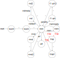
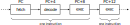
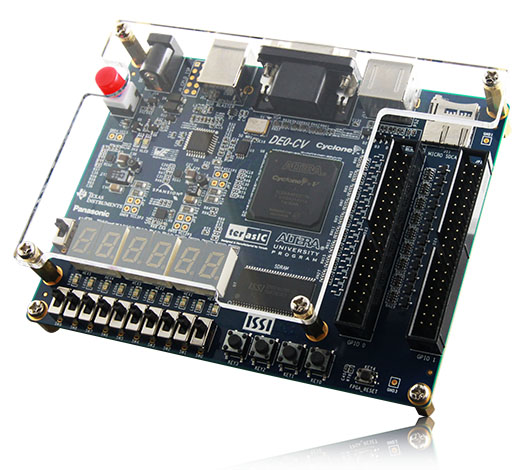
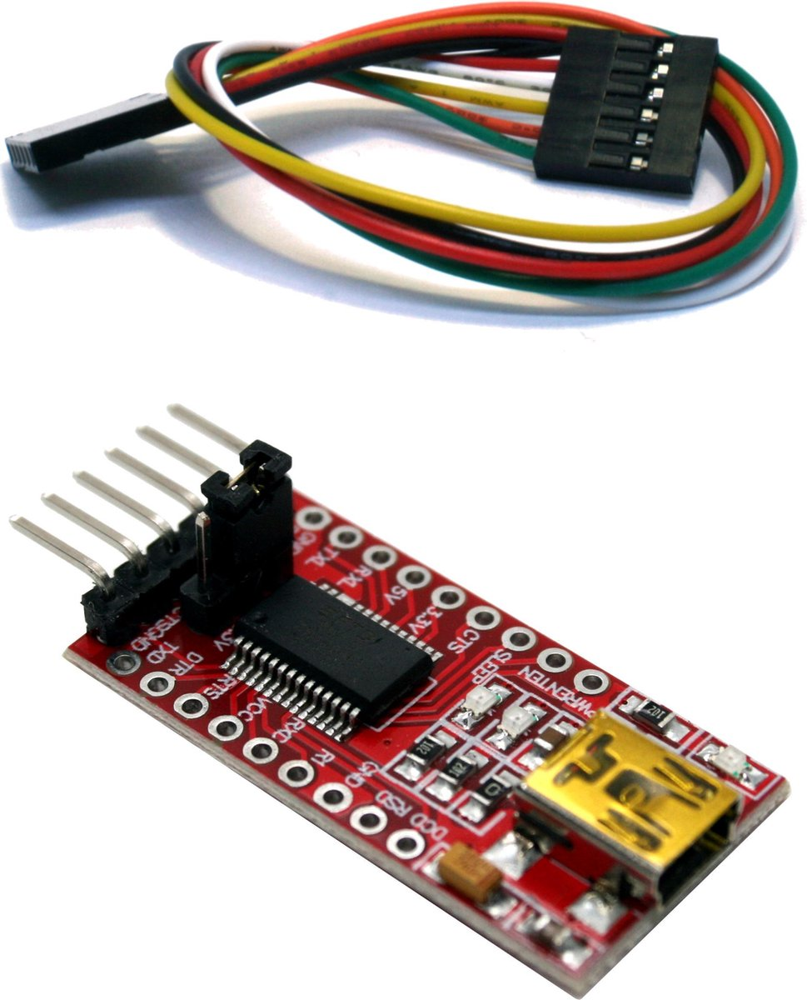

= The THUAS RISC-V 32-bit processor in VHDL
Jesse op den Brouw <j.e.j.opdenbrouw@hhs.nl>
:toc:

== Abstract

This documents describes a 32-bit RISC-V processor in VHDL. The processor executes the RV32IM instruction set with the Zicsr and Zicntr extensions (CSR and basic counters). The processor can optionally be equipped with the Zba and Zbs (bit operations), Zihpm (extra counters) and the Sdext and Sdtrig (on-chip debugger). The processor incorporates ROM, an optional boot ROM, RAM and some I/O. It is targeted for implementation on an FPGA. It is tested on an Intel Cyclone V with a DE0-CV development board from Terasic with the use of Quartus Prime Lite 23.1 and QuestaSim Intel Starter Edition 2023.3. The GNU C-compiler for RISC-V is used for software development. Many C programs were successfully tested using the GNU C compiler. {cpp} is supported but most standard concepts (e.g. cout) create a binary that is too big to fit in the ROM.

The processor has a three-stage pipeline and executes each instruction in three clock cycles, but the next instructions are fetched and decoded while the current instruction is executed. Jump/branches taken require three clock cycles. Memory reads need three clock cycles, writes take two clock cycles. This processor also has a basic Control and Status Registers (CSR) set, suitable to handle traps, and a hardware integer multiplier/divider.

This is work in progress. Things will certainly change in the future.

:sectnums:

== Introduction
This document describes the buildup of a simple, one core, RISC-V processor, completely written in VHDL. The core contains one _hart_ (Hardware Thread). The processor is able to run a compiled C-program. {cpp} is supported but some concepts (cout with iostream, STL) create binaries that are too big to fit in the ROM. The processor can handle the RV32IM Base Integer Instruction Set as set forward in ''The RISC-V Instruction Set Manual Volume I: Unprivileged ISA''. Also, the Zicsr, Zicntr, Zicond, Zihpm, Zba, Zbs, Sdext and Sdtrig extension are implemented. The processor can handle traps (interrupts/exceptions). The aim is to synthesize for a clock frequency of 85 MHz. The processor utilizes ROM, RAM and some simple I/O (including MTIME and MTIMECMP) effectively making it a microcontroller. The processor is designed on a Terasic DE0-CV board.

The processor is build around a three-stage pipeline: fetch, decode and execute stages. Most register instructions require one clock cycle to complete. Jumps, calls and branches taken require three clock cycles because a new instruction has to be fetched. Also, three clock cycles are needed when reading ROM (data), Writes take two clock cycles. RAM and I/O. ROM and RAM are implemented using onboard RAM block (which are buffered with an output register). The I/O output has a buffer register for reading to speed up the processor. The processor has a basic Control and Status Registers set, offering [M]CYCLE and [M]CYCLEH (completed clock cycles), TIME and TIMEH (time since last reset, in microseconds, shadowed from memory mapped registers), [M]INSTRET and [M]INSTRETH (number of retired instructions), and a basic set of CSRs to handle traps and on-chip debugging. A hardware multiplication requires three clock cycles to complete. A hardware division requires 32+2 or 16+2 clock cycles to complete, depending on the settings. CSR operations require one clock cycle.

The processor executes at top 1 CPI (clocks per instruction) with a sequential flow of instructions. Current CoreMark tests showed an average CPI of 1.73 with a throughput of 1.93 coremark/MHz (4000 runs).

== The processor
The RISC-V processor consists of one core and some building blocks:

The core:

* The registers contain intermediate data for calculations. The registers may be placed in onboard RAM or cell flip-flops.
* The ALU is responsible for almost all computations in the processor.
* The PC is used to point to the currently fetched instruction (not the instruction that is currently being executed).
* The Instruction Decoder decodes the fetched instruction and provides control signals to other building blocks.
* The multiply/divide unit calculates integer multiplications, divisions and remainder.
* The control unit regulates the data flow and control flow in the core.
* The Control and Status Registers (CSR) contains a basic set of registers.
* The Local Interrupt Controller (LIC) determines which trap is to be served.
* The memory unit interfaces with memory.
* The debug unit regulates on-chip debugging.

The remaining building blocks:

* The ROM contains the program instructions and constant data. When the bootloader is implemented, the ROM may be written.
* The bootloader ROM contains the program instructions and constant (read-only) data. The bootloader ROM may be excluded from the design
* The RAM contains read-write data (mutable data).
* The I/O is an interface with the outside world.
* The Address Decoder and Data Router is an interface between the memory (ROM, BOOT, RAM, I/O) and the ALU and registers.
* The instruction router routes instructions from the ROM and the boot ROM (if enabled).
* The debug module (DM) is an interface between the core and the debug module interface (DMI).
* The debug transport module (DTM) is an interface between the DMI and the external debug hardware.

=== Registers
The register file consists of thirty-two 32-bit registers denoted by `x0` to `x31`. Internally, the registers use Big Endian format. Register `x0` (alias `zero`) is hardwired to all zeros. Writing this register has no effect. Reading this register returns all zero bits. Normally, the `x`-names are not used but may be handy when simulating the designs. See Table <<tab_reg>>.
A register can be written to, and two register can be selected for data and/or base address.

.RISC-V registers
[[tab_reg]]
[cols="^1,^1,^1,^1"]
|===
| Register | Name | Purpose | Saver

| `x0`      | `zero`   | Hard-wired zero                   | $-$ 
| `x1`      | `ra`     | Return address                    | Caller 
| `x2`      | `sp`     | Stack pointer                     | Callee 
| `x3`      | `gp`     | Global pointer                    | $-$ 
| `x4`      | `tp`     | Thread pointer                    | $-$
| `x5`      | `t0`     | Temporary/alternate link register | Caller 
| `x6-x7`   | `t1-t2`  | Temporaries                       | Caller
| `x8`      | `s0/fp`  | Saved register/frame pointer      | Callee
| `x9`      | `s1`     | Saved register                    | Callee
| `x10-x11` | `a0-a1`  | Function arguments/return values  | Caller
| `x12-x17` | `a2-a7`  | Function arguments                | Caller
| `x18-x27` | `s2-s11` | Saved registers                   | Callee
| `x28-x31` | `t3-t6`  | Temporaries                       | Caller
|===

The register can optionally be put in ALM flip-flops. This increases the ALM count, but may have a positive effect in the clock speed.

=== ALU

The Arithmetic and Logic Unit (ALU) handles almost all computations on data. It can add, subtract, do logic operations such as AND, OR en XOR, can shift data left or right, and sign extend byte and half word data. Some operations require two registers, some only use one register. Some instructions use one register and immediate data. Furthermore the ALU is also used to determine if a conditional branch should be taken. Note that the RISC-V programmer's model does not incorporate status flags as some other architectures do. This requires some extra instructions when adding or subtracting double word (64-bit) data. This is handled by the C compiler. The ALU is also used to compute the return address from unconditional function calls (JAL and JALR instructions). The data is in Big Endian format. The ALU is the only building block that can write registers. The ALU does not compute multiplications and divisions, but merely passes on data from the MD unit.

Note that the computation of jump target addresses is handled by the Program Counter (PC) hardware.

=== PC

The Program Counter contains the address of the currently fetched instruction. The address is always on a 4-byte boundary although function calls and conditional jump (JAL, JALR en B_xx_ instructions) can be on non 4-byte boundaries (the C compiler will always create 4-bytes boundaries). The PC (or rather the VHDL description of the PC) handles the address calculations of jumps and branches taken.

=== Instruction Decoder

The instruction decoder decodes the instruction supplied by the ROM or boot ROM as pointed by the PC. An instruction is 4 bytes wide and in Little Endian order. The instruction decoder provides all control signals for the ALU, RAM, ROM, I/O, the PC, the Address Decoder, the CSR, the LIC, the register file and the MD unit.

=== Control Unit
The processor uses a eighteen-state FSM, see <<fig_fsm>> (without on-chip debugging). Upon reset, the processor starts in state `boot0`. In this state, the processor is executing a hardware no-operation, i.e. no computations are performed, but register `x0` (alias `zero`) is written with all-zero bits. This is because onboard RAM-blocks (where the registers are placed), cannot have a reset signal. In state `boot1` the processor performs a hardware no-operation (but the first instruction is being decoded). In the `exec` state, the processor is executing decoded instructions. If a trap request is being asserted, the processor executes the trap initiate sequence (saving the PC, fetching the handler start address, pipeline is flushed). If a memory access is requested, the processor initiates the memory access sequence (state `mem`). The processor waits in this state until the memory access is acknowledged. A jump (JAL, JALR) or a branch taken causes the processor to flush the pipeline and start fetching instruction from the target address (states `flush` and `flush2`). When the processor executes an integer multiply/divide instruction, the processor starts the MD sequence (states `md` and `md`), and stalls until the operation is completed. When the processor executes an `mret` instruction, the processor executes the return sequence (fetching the saved PC, flushing the pipeline).

.The state diagram of the controller, without the debug states.
[[fig_fsm]]

Note that a trap (interrupts and exceptions) can be initiated in the `exec` state and has priority over the others signals. Note that a trap (exceptions only) can be initiated in the `mem` state.  Tn the `wfi` state, only a interrupt can be initiated. In all other states, a trap can never be initiated.

The PC points to +8 of the currently executing instruction, in a sequential instruction stream. If a jump or branch taken occurs, the FSM inserts a penalty because the PC has to be loaded with the correct value and a new instruction must be fetched (see <<fig_one>>). Reading RAM, ROM and I/O requires three clock cycles (see <<fig_load>>), a write requires two clock cycles. When a multiply, divide or remainder instruction is encountered, the FSM enters the `md` state and waits for the md-unit to complete (32+2 or 16+2 clock cycles). Note that `penalty`, `mem`, `mdstart` and `mret` cannot occur at the same time.

.Execution of one instruction.
[[fig_one]]

.Execution of a load instruction.
[[fig_load]]

=== Trap handling

When an interrupt occurs, the FSM enters the `trap` state for fetching the trap vector. An interrupt can occur any time and is called asynchronous. When an interrupt occurs, the current instruction is aborted and must be restarted after return. After fetching the trap handler, new instructions are fetched and the instruction pipeline is flushed.

Exceptions are synchronous to the executing of instructions. When an exception occurs, the current instruction is discarded and must be restarted after return. Exceptions to this are the `ECALL` and `EBREAK` instructions. These instructions do cause a trap, but are not restarted, so the next instruction must be fetched after return. This has to be handled in software by the trap handler. 

An ongoing memory access can only be interrupted by an exception (`mem` state). An ongoing hardware multiply/divide operation is *not* interrupted, the operation completes and writes back the result in a register.

When a trap request is asserted, the trap vector is loaded in the next clock cycle. Then, in the second clock cycle, the instruction is fetched and in the third clock cycle the instruction is decoded and in the fourth cycle the instruction is executed. On return from a trap handler, the original contents of the PC is fetched from the CSR and then instructions are fetched. A return flushes the pipeline.

The following exceptions are implemented:

* ECALL -- M-mode only
* EBREAK -- break to debugger, debug mode
* Load access fault -- reading unimplemented memory
* Store access fault -- writing unimplemented memeory
* Load address misaligned -- not natural aligned for halfword and word
* Store address misaligned -- not natural aligned for halfword and word
* Illegal instruction -- instruction is not valid
* Instruction access fault -- reading unimplemented memory
* Instruction address misaligned -- not on a 4-byte boundary

The `mtval` CSR is written with offending memory address for load/store access/misaligned fault. For the remaining exceptions `mtval` is set to all-zero bits.

=== Address Decoder and Data Router

The Address Decoder and Data Router routes reads and writes to the memory (ROM, bootloader ROM (only reads), RAM and the I/O). The processor uses a 32-bit linear address space for memory accesses. The address space is divided in 16 parts of 256 MB each. In the default setting, ROM starts at address 0x00000000 and the length is 64 kB. The bootloader ROM starts at address 0x10000000 and the length is 4 kB. Unused ROM addresses return 0x0000000. The RAM starts at address 0x20000000 and length is 32 kB. The I/O starts at address 0xF0000000 and the length is 16 kB by default.

When data is read, the data is collected from the accessed memory and put on an internal bus to the ALU. The ALU can perform sign extension or zero extenstion (byte and half word accesses) if needed. Please note that reading data from the ROM, bootloader ROM, RAM and I/O requires three clock cycles. Writing requires two clock cycles.

Note that instructions can only be fetched from ROM and boot ROM.

=== Instruction Router

The Instruction Router routes instructions from the ROM and the boot ROM. If the boot ROM is disabled, the synthesizer will remove access to boot ROM.

=== Control and Status registers

The RISC-V specification describes a set of 4096 control and status register in a separate address space. CSR operations require one clock cycle. Basic event counters are implemented:

* `[m]cycle` and `[m]cycleh` -- these 32-bit registers form a 64-bit value that contains the counted clock cycles since the last reset.
* `time` and `timeh` -- these registers shadow the contents of the `MTIME` and `MTIMEH` registers from the I/O.
* `[m]instret` and `[m]instreth` -- these 32-bit registers form a 64-bit value that contains the counted retired instructions since the last reset.

Note that `time` and `timeh` are read-only. Writes are ignored.

Generic registers:

* `mvendorid` -- this register is hardwired to all zero bits.
* `marchid` -- this register is hardwired to all zero bits.
* `mimpid` -- this register is hardwired to the current version of the hardware.
* `mhartid` -- this register is hardwired to all zero bits.
* `mconfigptr` -- this register is hardwired to all zero bits.
* `misa` -- hardwired to value 0x40001100, indicating 32-bit processing, RV32I base ISA and Integer Multiply/Divide extension, or hardwired to 0x40001010 for E extension. If the MD unit is excluded from the design, bit 12 of `misa` is 0.

For trap handling, the following registers are implemented:

* `mstatus` -- the only implemented bits are `MIE`, `MPIE` and `MPP`, all other bits are hardwired zero.
* `mie` -- for the lower 16 bits, only `MTIE` and `MSI` are implemented, all other bits are hardwired zero.
* `mtvec` -- contains the trap handler (vector) address, can be used in direct and vectored mode, and bit 1 is always 0.
* `mstatush` -- this register is hardwired to all zero bits.
* `mscratch` -- currently not used, but can be used by software trap handlers.
* `mepc` -- contains the PC at point of trap of the *currently* executing instruction.
* `mcause` -- contains the cause of the trap as set forward in ''The RISC-V Instruction Set Manual, Volume II: Privileged Architecture''. For local interrupts, additional codes are used.
* `mtval` -- contains the address on the address bus when a trap occurs, or all-zero bits if not relevant.
* `mip` -- contains the pending interrupts. For the lower 16 bits, only `MTIP` is implemented. The upper 16 bits are used for local interrupts. This register is read-only.

For counting purposes, the following registers are implemented:

* `mcountinhibit` -- this register has bits 9 to 2 (`minstret`) and bit 0 (`mcycle`) implemented.
* `mhpmcounter3` to `mhpmcounter9` -- low order event counter registers.
* `mhpmcounter3h` to `mhpmcounter9h` -- high order event counter registers.
* `mhpmevent3` to `mhpmevent9` -- counter event select registers.

The event counter registers are currently 40 bits wide. Currently, there are 7 events that can be counted:

[cols="1,1"]
|===
|bit | event

|0 | jumps/branches taken
|1 | stall cycles
|2 | stores
|3 | loads
|4 | ECALLs
|5 | EBREAK
|6 | multiply/divides
|===

For on-chip debugging purposes, there are six CSRs:

* `dcsr` -- this register holds information between the DM and de hart.
* `dpc` -- this register hold the PC value of the instruction to be executed when the core enters debug mode.
* `tselect` -- this register is used to select a hardware breakpoint, since there is only one hardware breakpoint available this register is hardwrired to all-zero bits.
* `tdata1` -- this register selects the trigger type for hardware triggering, only type 6 is supported, and only instruction address breakpoint is available.
* `tdata2` -- this register holds the instruction address of the breakpoint.
* `tinfo` -- this register holds additional trigger information.

Custom CSR:

* `mxhw` -- this custom CSR with address 0xfc0 is read-only and reflects the hardware properties of the synthesized processor.
* `mxspeed` -- this custom CSR with address 0xfc1 is read-only and contains the system frequency in Hz of the synthesized processor.

Writing read-only registers causes an illegal instruction trap. Accessing a non-existent register causes an illegal instruction trap. The trap handler (vector) address must be loaded by software at boot time (normally done in `main`). Both direct and vectored mode are supported. In direct mode all traps redirect to a single trap handler that has to handle both interrupts and exceptions. The most significant bit of `mcause` is 1 when a trap occurred from an interrupt. In vectored mode, the addresses of *interrupt handlers* are loaded from a jump table. Exceptions are redirected to a single handler. Note that the address of the jump table must be on a 4-byte boundary, and bit 0 of `mtvec` must be set to 1 for vectored mode.

=== Local Interrupt Controller

The Local Interrupt Controller is responsible for selecting which trap request must be serviced by the core. Interrupts have higher priority than exceptions. The state of the serviced trap is visible in the CSR.

The LIC can handle 16 local interrupts (numbered 16 to 31), the Machine mode external timer interrupt (numbered 7) and the Machine mode software interrupt (numbered 3). Other standard RISC-V interrupts (numbered 0 to 2, 4 to 6 and 8 to 15) are not available. NMI has the highest priority, followed (currently) by the SPI1, I2C1, I2C2, UART1, TIMER2, TIMER1, EXTI external input interrupt, Machine Software Interrupt and external system timer interrupts. The NMI is connected to the watchdog timer.

Exceptions are handled as set forward in Table 3.7 of ''The RISC-V Instruction Set Manual, Volume II: Privileged Architecture'': instruction access fault, instruction address misaligned, ECALL (M mode only), EBREAK, load/store address misaligned, load/store access fault. Note that ECALL and EBREAK are user instructions and can be interrupted by an interrupt (i.e. when the ECALL or EBREAK instruction is executing).

=== Multiply/Divide Unit

The processor is equipped with a hardware integer multiply/divide unit. All multiply/divide instructions are supported (`MUL`, `MULH`, `MULHSU`, `MULHU`, `DIV`, `DIVU`, `REM`, `REMU`) and the result is fed to the ALU. A multiplication takes three clock cycles (one clock-in, one multiply, one clock-out). For division, two versions are available. By default, the divider needs 18 clocks (one clock-in, 16 divide, one clock-out) for a division using a poor man's radix-4 division unit. As an alternative, a simple radix-2 division unit can be selected taking 34 clock cycles (one clock-in, 32 divide, one clock-out) to do the division. Thus, the radix-4 divider unit is faster, but needs more cells. The radix-2 divider unit is slower, but needs less cells. You have to enable the M standard support in the compiler. The multiplier uses special DSP units in the Cyclone V. Most regular FPGAs have onboard multipliers. Note that when executing an operation, the pipeline is stalled. Note that a trap request is postponed until the operation is completed and the result is saved in the register file. Selecting the radix-4 division has a minimum impact on the clock speed.

=== Debug Module and Debug Transport Module

The processor can be equipped with on-chip hardware debug support (Sdext and Sdtrig) following the guidelines of the debug specification. The debug transport module (DTM) is an interface between the debug hardware outside of the processor and the debug module interface (DMI) The DTM uses JTAG to communicate. The DMI is a simple request/response interface and connects to the debug module (DM). The DM connects to the processor core. Using the on-chip debugger, it is possible to set up a hardware breakpoint, single-step, examine registers and memory. The on-chip debugger is compatible with OpenOCD, GDB and Eclipse-CDT.

=== Reset

The asynchronous reset is active high. All registers are either set to 0 or 1 when the reset is active. The onboard RAM blocks don't have a reset signal. This means that the processor's RAM contents is undefined. The ROM and the boot ROM (implemented in onboard RAM) are set to known values when the bitstream is programmed. The reset hardware uses a 3-stage reset synchronizer. It is possible to reset the processor when UART1 receives a BREAK condition. It is also possible to reset the processor when the watchdog (WDT) times out or a reset from the on-chip debugger.

=== Implemented instructions

For the processor, all RV32IM Unprivileged instructions are implemented but the FENCE instruction act as a no-operation (NOP). ECALL and EBREAK are supported and execute an exception. Also, the Zicsr, Zba, Zbs and Zicond instructions are implemented (selectable). From the Privileged instructions, WFI is implemented and halts the processor at (PC + 4). MRET is used to return from an exception or an interrupt. FENCE.I acts as a NOP.

== Memories

The are four memories: ROM, boot ROM, RAM and I/O.

=== ROM

The ROM consists of bytes and is only word addressable for instructions. The ROM is byte, half word and word addressable when reading constant data. Half word and word entries are in Litte Endian format. When reading data from the ROM, half word accesses must be on 2-byte boundaries and word accesses must be on 4-byte boundaries. This simplifies the decoding circuitry. The ROM returns undefined data if an access is not aligned and will generate an exception. The processor instantiates the ROM in onboard RAM. Rearranging half word and word data accesses in Big Endian format is handled by the ROM decoding unit. Reading ROM (as data) requires three cycles. This is automatically handled by the processor. The pipeline is stalled for two clock cycles when reading from ROM (data). Reading instructions requires two clock cycles.

When the bootloader hardware is installed, the ROM is writable as words only. Although this write option is reserved for the bootloader, a user program can manipulate the ROM. A write requires one or two clock cycles, depending on the VHDL generic `HAVE_FAST_STORE`.

Note: the Cyclone V 5CEBA4F23C7 has 3,153,920 bits of onboard RAM available. Because of the 32-bit entries a maximum of 2,097,152 (65536 x 32) bits can be instantiated. This is equivalent to 262,144 bytes.

Note: instructions can only be fetched from the ROM and bootloader ROM.

=== Bootloader ROM

The bootloader ROM contains a small program to upload S-record files in the ROM. The bootloader ROM cannot be written by an upload. Besides that, the bootloader contains a simple monitor program. The bootloader ROM is places in onboard immutable RAM blocks. The bootloader may be excluded from synthesis. Note that the bootloader firmware is generated with RV32IM.

=== RAM

The RAM consists of bytes and is byte, half word and word addressable. Half word and word entries are in Little Endian format. The RAM itself is made up of word (i.e. 32-bit) entries and is instantiated with onboard RAM blocks. Due to this fact, half word accesses are only permitted on 2-byte boundaries and word accesses are only permitted on 4-byte boundaries. The RAM returns undefined data if an access is not aligned. Writes will not take place if an access is unaligned. This simplifies the decoding circuitry. Unaligned accesses cause an exception. For the Cyclone V a maximum of 65536 words of RAM can be instantiated. Rearranging half word and word data accesses in Big Endian format is handled by the RAM decoding unit. The RAM cannot be used for program data.

Note: the Cyclone V 5CEBA4F23C7 has 3,153,920 bits of onboard RAM available. Because of the 32-bit entries a maximum of 2,097,152 (65536 x 32) bits can be instantiated. This is equivalent to 262,144 bytes.

Reading the RAM (byte, half word, word) requires three clock cycles. A write requires one or two clock cycles, depending on the VHDL generic `HAVE_FAST_STORE`.

=== I/O

Currently, the I/O consists of one 32-bit data input and one 32-bit data output, a simple UART with interrupts, a simple timer with interrupt, a more elaborate timer with interrupt, two minimal I2C peripherals with interrupt, a general purpose SPI peripheral with interrupt, a simple SPI peripheral (no interrupt), a watchdog timer, a software interrupt unit and the TIME and TIMEH memory mapped time registers with interrupt. Note that the I/O can only be accessed as words and the addresses must be on 4-byte boundaries. If not on a 4-byte boundaries or not word size reads/writes, reads return undefined data whereas writes will not write data. Unaligned accesses cause an exception. A read requires three clock cycles, a write requires one or two clock cycles, depending on the VHDL generic `HAVE_FAST_STORE`. Note that not all I/O addresses are used.

GPIOA has separate inputs and output, both 32 bits. This is because some FPGAs/synthesizers don't allow buried tri-state signals, i.e. the tri-state action must be done in the top level entity. Because of that, there is no data direction register. Currently the inputs come from the slide switches and the push buttons. Note that KEY4 a.k.a. FPGA_RESET is connected to the reset of the processor. The outputs are connected to the 10 red leds and to the two least significant 7-segment displays. Also two output pins are connected to facilitate SPI software generated NSS signals. The GPIOA module is equipped with a pin input edge detector generating an interrupt if a rising and/or falling edge is detected.

UART1 can transmit and receive data at 7, 8 or 9 bits, no/even/odd parity and 1 or 2 stop bits. Tested speeds are 9600 bps, 115200 bps and 230400 bps. Several status flags are implemented to guide transmission. Receive, transmitted and BREAK character (local) interrupts are provided (one vector). These interrupt requests must be negated by software. A BREAK condition is found if UART1 samples 1 start bit + number of data bits + 1 stop bit to be low. UART1 does not provide hardware flow control.

TIMER1 has a 32-bit count register and increments on every clock cycle. It does not have a prescaler. It counts up to compare match T register, after which is will be loaded with 0 again. A compare match (local) interrupt is provided (one vector). Whenever the timer count register is greater than or equal to the compare match T register, an interrupt request is asserted in the next clock cycle. The interrupt request has to be negated by software. A value of 0 in the compare match T register is valid: the counter does not count, but the compare match (local) interrupt is asserted.

TIMER2 has a 16-bit count register and a 16-bit prescaler, and increments on every clock cycle. The counter can be used to generate signals (Output Compare/PWM) or detect incoming signal edges (Input Capture). When in output mode. the timer counts up to compare match T register, after which is will be loaded with 0 again. Compare match (local) interrupts are provided (one vector). Whenever the timer count register is greater than or equal to the compare match T register, an interrupt request is asserted. The interrupt request has to be negated by software. The timer provides three Channels with compare registers (A, B, C). Whenever the timer count register is greater than or equal to a compare register (A, B, C) the respective interrupt request is asserted. The interrupt requests have to be negated by software. A value of 0 in the compare match T register is valid: the counter does not count, but the compare match T (local) interrupt is asserted and the compare match interrupts (A, B, C) are asserted whenever the respective compare match register is 0. The prescaler is always preloaded: if the timer is off, the shadow prescaler register is directly written, if the timer is running, the preload register is written and the shadow register is updated at the the next CMPT match. The CMPT/A/B/C registers may optionally use a preload register. If preload is off, the shadow registers are directly written, if preload is on, the preload registers are written and the shadow registers are updated at the next CMPT match. In Input Compare mode, the Channels A, B and C can be selected to trigger on a positive or negative edge. When an edge is detected, the current value of CNTR is copied to the accompanying CMP_x_ register and the accompanying interrupt flag is asserted. Note that Channel T cannot be used for PWM and input capture. The input capture circuits use a two-stage synchronizer. 

I2C1 is a minimal I2C controller peripheral (master-only). It cannot react to clock stretching and lost arbitration, so only modern targets (slaves) can be connected in a one-master-only system. Both Standard mode (Sm) with a transmission speed of up to 100 kbps and Fast mode (Fm) with a transmission speed up to 400 kbps are implemented. Before sending the address byte, the send-start bit must be set and a START condition is send to the target when the address is written to the I2C1 data register. Before sending or receiving the last data byte, the send-stop bit must be set and a STOP condition is send to the target after the byte is send or received by the controller. The last byte received will not be acknowledged by the controller. When receiving intermediate bytes, the controller must acknowledge the reception with an ACK. This is controlled by the MACK bit in the control register. Sending a byte is straightforward: just write the byte to the data register. When receiving a byte, a dummy byte (data value of 0xff) must be send to the target. This way, the processor can create a pause in the transmission if needed. Note that the SCL line is kept low between byte transmissions. The baud rate prescaler must be loaded with the number of system clock cycles of *one-half* bit time minus 1 for Standard mode and *one-third* bit time minus 1 for Fast mode. Note that the prescaler is part of the control register CTRL and its value must be preserved when setting or clearing other bits. The SCL and SDA inputs are synchronized to the system clock using two 2-bit shift registers.

I2C2 is exact copy of I2C1, but with a different interrupt priority.

SPI1 is a full-fledged SPI master. It can transfer 8-bit, 16-bit, 24-bit and 32-bit data in one SPI cycle. It incorporates a programmable prescaler (from /2 to /256 in powers of 2) and all four phases of clock polarity (CPOL) and phase polarity (CPHA), hardware NSS (Slave Select, active low) and programmable Slave Select setup and hold time. It is possible to use a GPIO pin to use software-controlled NSS. Currently, the MISO is not synchronized to the system clock.

SPI2 is a simple SPI master dedicated for the micro SC card reader (DE0-CV board). It can transfer 8-bit, 16-bit, 24-bit and 32-bit data in one SPI cycle. It does not have an hardware NSS signal and no interrupt capability. A single I/O pin is needed for NSS. Currently, the MISO is not synchronized to the system clock.

WDT is a simple watchdog that can trigger a system wide reset or a non-maskable interrupt (NMI). The NMI cannot be blocked. The NMI uses the same mechanism as other traps, so `mtvec` must point to a trap handler.

The I/O houses a memory mapped MSI trigger register. Writing a 1 to the trigger register will fire an MSI if `mie.MSIE` is set. As long a the trigger register is set to 1, MSIs will be fired. Cleared by writing a 0.

The I/O incorporates memory mapped TIMEH:TIME and TIMECMPH:TIMECMP registers. Whenever TIMEH:TIME (as viewed as a 64-bit register) is greater than or equal to TIMECMPH:TIMECMP (as viewed as a 64-bit register) an interrupt request is asserted. The interrupt request is negated if TIMEH:TIME is less than TIMECMPH:TIMECMP. This has to be handled by software. Currently the TIMEH and TIME registers cannot be written. Note that TIMEH:TIME counts the number of microseconds since last reset. The toolchain expects this since `clock()` and `gettimeofday()` depend on this value. As such, the system clock frequency must be a integer multiple of 1 MHz. Note that TIMEH:TIME is writable by software.

== The FPGA
For this project, we use the Cyclone V FPGA from Intel (formerly Altera). See https://www.intel.com/content/www/us/en/products/details/fpga/cyclone/v.html.
The used Cyclone V is the 5CEBA4F23C7 which has 18480 ALMs available. It has 3080 kb of onboard RAM bits available which are used for RAM, ROM, (possibly) bootloader ROM and (possibly) the registers. Depending on the program and used resources, the compiled RISC-V processor uses about 2900 ALMs (about 16%) and 1,378,304 bits of internal memory (44%). The clock frequency is approximately 80 MHz, which is sufficient for all program examples. Note that the DE0-CV board has a onboard clock generator with a frequency of 50 MHz, so a PLL is needed to get a frequency of 80 MHz. This FPGA is mounted on a Terasic DE0-CV board (see <<fig_de0cv>>. The board has 10 switches, 4 push buttons, 1 reset push button, 10 leds, and 6 seven-segment displays. It also has two 2x20-pin headers to connect off-board devices. See http://www.terasic.com.tw/cgi-bin/page/archive.pl?Language=English&No=921. For downloading the bitstream file, the onboard USB-Blaster is used.

.The DE0-CV board.
[[fig_de0cv]]

Disabling the bootloader saves one copy of the ROM and the bootloader ROM. Then the used RAM is 786,432 bits (25%). Disabling registers in RAM saves 2048 bits, but increases the ALM count. You may see some warnings from the synthesizer.

Disabling the boot ROM and enabling the on-chip debugger increases the ALM count to 3500 (19%).

It is possible to add the Quartus' Signal Tap (embedded) Logic Analyzer. Follow the instructions on https://people.ece.cornell.edu/land/courses/ece5760/Quartus/Signal_tap.html. Note that the Signal Tap uses onboard memory.

To find the best compilation result for speed and/or area, we have to tweak the compiler setting for the synthesizer and the fitter. Best is to do a design space exploration, and randomize the seed. Tweaking the seed may show a difference of 5 MHz on the clock speed.

Table <<tab_metrics>> gives some estimates on the design. In all cases, the seed is set to 1 and the optimization is set to balanced. The total amount of ALMs is 18480. The total amount of RAM bits is 3153920.

.FPGA resource utilization for the DE0-CV board (Slow 1100mV 85C model).
[[tab_metrics]]
[cols="1,1,1,1]
|===
| Setup | $f_{max}$ | ALMs | FFs | RAM

| Default {all I/O, MD, no extensions, no OCD} | 93 | 2861 | 2467 | 1,345,536
| Default, no bootloader, no OCD               | 92 | 2911 | 2445 | 788,480
| Default, only UART1 + bootloader, no OCD     | 92 | 2110 | 1447 | 1,345,536
| Small (UART1, no boot, no MD, no OCD)        | 91 | 1693 | 1269 | 788,480 
| Default OCD (no bootloader, OCD)             | 87 | 3490 | 3005 | 1,313,792
| Full OCD (all extensions, OCD)               | 86 | 4463 | 3470 | 1,313,792
|===

== Processor hardware

The processor hardware is composed of the following VHDL files:

* `processor_common.vhd` -- Common types and constants.
* `address_decode.vhd` -- The address decoder and data router to the memory
* `core.vhd` -- The core contains the PC, the registers, the ALU, the MD unit, the control state machine, the memory interface, the CSR and the LIC.
* `instr_router.vhd` -- Description of the instruction router.
* `rom.vhd` -- Description of the ROM. Will be placed in onboard, initialized RAM blocks. 
* `rom_image.vhd` -- Description of the ROM contents.
* `bootloader.vhd` -- Description of the bootloader ROM. The bootloader program will be placed in onboard, initialized RAM blocks.
* `bootrom_image.vhd` -- Description of the boot ROM contents.
* `ram.vhd` -- Description of the RAM. Will be placed in onboard, uninitialized RAM blocks. 
* `io.vhd` -- Description of the I/O. It contains a 32-bit input register, a 32-bit output register, an UART, I2C, SPI, timers, watchdog, MSI and the TIME and TIMECMP memory mapped registers.
* `dm.vhd` -- Description of the Debug Module.
* `dtm.vhd` -- Description of the Debug Transport Module.
* `riscv.vhd` -- Top-level description of the processor. Connects all the building blocks to a viable processor.
* `riscv.sdc` -- Constraints file. Sets the target clock frequency.
* `tb_riscv.vhd` -- VHDL testbench to simulate the design.
* `tb_riscv.do` -- QuestaSim/Modelsim command script.

The entity of the top level (`riscv.vhd`) is shown in the listing below.

[source,vhdl,subs=attributes+]
----
entity riscv is
    generic (
         -- The frequency of the system
          SYSTEM_FREQUENCY : integer;
          -- Frequecy of the hardware clock
          CLOCK_FREQUENCY : integer;
          -- Have On-chip debugger?
          HAVE_OCD : boolean;
          -- Do we have a bootloader ROM?
          HAVE_BOOTLOADER_ROM : boolean;
          -- Disable CSR address check when in debug mode
          OCD_CSR_CHECK_DISABLE : boolean;
          -- RISCV E (embedded) of RISCV I (full)
          HAVE_RISCV_E : boolean;
          -- Do we have the integer multiply/divide unit?
          HAVE_MULDIV : boolean;
          -- Fast divide (needs more area)?
          FAST_DIVIDE : boolean;
          -- Do we have Zba (sh?add)
          HAVE_ZBA : boolean;
          -- Do we have Zbs (bit instructions)?
          HAVE_ZBS : boolean;
          -- Do we have Zicond (czero.{eqz|nez})?
          HAVE_ZICOND : boolean;
          -- Do we have HPM counters?
          HAVE_ZIHPM : boolean;
          -- Do we enable vectored mode for mtvec?
          VECTORED_MTVEC : boolean;
          -- Do we have registers is RAM?
          HAVE_REGISTERS_IN_RAM : boolean;
          -- Address width in bits, size is 2**bits
          ROM_ADDRESS_BITS : integer;
          -- Address width in bits, size is 2**bits
          RAM_ADDRESS_BITS : integer;
          -- 4 high bits of ROM address
          ROM_HIGH_NIBBLE : memory_high_nibble;
          -- 4 high bits of boot ROM address
          BOOT_HIGH_NIBBLE : memory_high_nibble;
          -- 4 high bits of RAM address
          RAM_HIGH_NIBBLE : memory_high_nibble;
          -- 4 high bits of I/O address
          IO_HIGH_NIBBLE : memory_high_nibble;
          -- Do we use fast store?
          HAVE_FAST_STORE : boolean;
          -- Do we have UART1?
          HAVE_UART1 : boolean;
          -- Do we have SPI1?
          HAVE_SPI1 : boolean;
          -- Do we have SPI2?
          HAVE_SPI2 : boolean;
          -- Do we have I2C1?
          HAVE_I2C1 : boolean;
          -- Do we have I2C2?
          HAVE_I2C2 : boolean;
          -- Do we have TIMER1?
          HAVE_TIMER1 : boolean;
          -- Do we have TIMER2?
          HAVE_TIMER2 : boolean;
          -- use watchdog?
          HAVE_WDT : boolean;
          -- UART1 BREAK triggers system reset
          UART1_BREAK_RESETS : boolean
         );
    port (I_clk : in std_logic;
          I_areset : in std_logic;
          -- JTAG connection
          I_trst : in  std_logic;
          I_tms  : in  std_logic;
          I_tck  : in  std_logic;
          I_tdi  : in  std_logic;
          O_tdo  : out std_logic;
          -- GPIOA
          I_gpioapin : in data_type;
          O_gpioapout : out data_type;
          -- UART1
          I_uart1rxd : in std_logic;
          O_uart1txd : out std_logic;
          -- I2C1
          IO_i2c1scl : inout std_logic;
          IO_i2c1sda : inout std_logic;
          -- I2C2
          IO_i2c2scl : inout std_logic;
          IO_i2c2sda : inout std_logic;
          -- SPI1
          O_spi1sck : out std_logic;
          O_spi1mosi : out std_logic;
          I_spi1miso : in std_logic;
          O_spi1nss : out std_logic;
          -- SPI2
          O_spi2sck : out std_logic;
          O_spi2mosi : out std_logic;
          I_spi2miso : in std_logic;
          -- TIMER2
          O_timer2oct : out std_logic;
          IO_timer2icoca : inout std_logic;
          IO_timer2icocb : inout std_logic;
          IO_timer2icocc : inout std_logic
         );
end entity riscv;
----

=== Pin assignments
The pin assignments for the DE0-CV board are as follows. Note that not all signals are assigned to a pin, in which case the fitter will assign a suitable pin.

.Pin assignments for the DE0-CV board.
[cols="1,1,1"]
|===
| Signal | Pin Name | Board name, comments

|clk           | M9       | CLOCK_50, System clock
|areset        | P22      | FPGA_RESET, active low reset
|gpioapin[31]  | $-$      | Fitter assigned
|gpioapin[30]  | $-$      | Fitter assigned
|gpioapin[29]  | $-$      | Fitter assigned
|gpioapin[28]  | $-$      | Fitter assigned
|gpioapin[27]  | $-$      | Fitter assigned
|gpioapin[26]  | $-$      | Fitter assigned
|gpioapin[25]  | $-$      | Fitter assigned
|gpioapin[24]  | $-$      | Fitter assigned
|gpioapin[23]  | $-$      | Fitter assigned
|gpioapin[22]  | $-$      | Fitter assigned
|gpioapin[21]  | $-$      | Fitter assigned
|gpioapin[20]  | $-$      | Fitter assigned
|gpioapin[19]  | $-$      | Fitter assigned
|gpioapin[18]  | $-$      | Fitter assigned
|gpioapin[17]  | $-$      | Fitter assigned
|gpioapin[16]  | $-$      | Fitter assigned
|gpioapin[15]  | M6       | KEY3, active low
|gpioapin[14]  | M7       | KEY2
|gpioapin[13]  | W9       | KEY1
|gpioapin[12]  | U7       | KEY0
|gpioapin[11]  | $-$      | Fitter assigned
|gpioapin[10]  | $-$      | Fitter assigned
|gpioapin[9]   | AB12     | SW9, active high
|gpioapin[8]   | AB13     | SW8
|gpioapin[7]   | AA13     | SW7
|gpioapin[6]   | AA14     | SW6
|gpioapin[5]   | AB15     | SW5
|gpioapin[4]   | AA15     | SW4
|gpioapin[3]   | T12      | SW3
|gpioapin[2]   | T13      | SW2
|gpioapin[1]   | V13      | SW1
|gpioapin[0]   | U13      | SW0
|gpioapout[31] | $-$      | Fitter assigned
|gpioapout[30] | U22      | HEX16, active low
|gpioapout[29] | AA17     | HEX15
|gpioapout[28] | AB18     | HEX14
|gpioapout[27] | AA18     | HEX13
|gpioapout[26] | AA19     | HEX12
|gpioapout[25] | AB20     | HEX11
|gpioapout[24] | AA29     | HEX10
|gpioapout[23] | $-$      | Fitter assigned
|gpioapout[22] | AA22     | HEX06
|gpioapout[21] | Y21      | HEX05
|gpioapout[20] | Y22      | HEX04
|gpioapout[19] | W21      | HEX03
|gpioapout[18] | W22      | HEX02
|gpioapout[17] | V21      | HEX01
|gpioapout[16] | U21      | HEX00
|gpioapout[15] | T17      | GPIO_0_D34, for SPI1 software NSS
|gpioapout[14] | C11      | SDDAT3, SPI2 software NSS
|gpioapout[13] | $-$      | Fitter assigned
|gpioapout[12] | $-$      | Fitter assigned
|gpioapout[11] | $-$      | Fitter assigned
|gpioapout[10] | $-$      | Fitter assigned
|gpioapout[9]  | L1       | LEDR9, active high
|gpioapout[8]  | L2       | LEDR8
|gpioapout[7]  | U1       | LEDR7
|gpioapout[6]  | U2       | LEDR6
|gpioapout[5]  | N1       | LEDR5
|gpioapout[4]  | N2       | LEDR4
|gpioapout[3]  | Y3       | LEDR3
|gpioapout[2]  | W2       | LEDR2
|gpioapout[1]  | AA1      | LEDR1
|gpioapout[0]  | AA2      | LEDR0
|uart1rxd      | N19      | GPIO_0_D15, UART1 receive
|uart1txd      | P19      | GPIO_0_D17, UART1 transmit
|timer2oct     | N21      | GPIO_0_D10, output compare T
|timer2icoca   | R21      | GPIO_0_D12, output compare/PWM/input capture A
|timer2icocb   | N20      | GPIO_0_D14, output compare/PWM/input capture B
|timer2icocc   | M22      | GPIO_0_D16, output compare/PWM/input capture C
|spi1sck       | K19      | GPIO_0_D26, SPI1 clock
|spi1mosi      | R15      | GPIO_0_D28, SPI1 MOSI
|spi1miso      | R16      | GPIO_0_D30, SPI1 MISO
|spi1nss       | T19      | GPIO_0_D32, SPI1 hardware NSS
|spi2sck       | H11      | SDCLOCK, SPI2 clock
|spi2mosi      | B11      | SDCMD, SPI2 MOSI
|spi2miso      | K9       | SDDAT0, SPI2 MISO
|i2c1scl       | B16      | GPIO_0_D1, I2C1 SCL
|i2c1sda       | C16      | GPIO_0_D3, I2C1 SDA
|i2c2scl       | K20      | GPIO_0_D5, I2C1 SCL
|i2c2sda       | K22      | GPIO_0_D6, I2C1 SDA
|tck           | P18      | GPIO_0_27 , JTAG clock
|tdi           | R17      | GPIO_0_29 , JTAG data in
|tdo           | T20      | GPIO_0_31 , JTAG data out
|tms           | T18      | GPIO_0_33 , JTAG select
|trst          | T15      | GPIO_0_35 , JTAG reset
|===

Some pins are connected to the onboard GPIO headers. The DE0-CV board has two headers but currently only GPIO 0 is used.

image::images/de0-cv-gpio.pdf[DE0-CV GPIO pin layout]

=== Simulation
The design can be simulated fully, using QuestaSim Intel Starter or ModelSim Intel Starter. You need a (free) license for QuestaSim. During simulation, all essential signals can be viewed, as is the RAM. The RAM is viewed as 32-bit entries, so we need to do some manual calculations to correctly find byte, half word and word accesses. Simulation can be started from Quartus. Please note that the bootloader must be disabled for normal program start up. 

=== Customizing the design
Using VHDL generics, the design can be customized.

.Customization options for the design.
[cols="1,1,1,1"]
|===
|Generic | Type | Typical | Comment

|SYSTEM_FREQUENCY| integer | 50000000 | The system frequency in Hz
|CLOCK_FREQUENCY| integer | 1000000 | The clock frequency in Hz
|HAVE_OCD| boolean | false | Enable on-chip debugging
|OCD_CSR_CHECK_DISABLE| boolean | false | Disable CSR address check
|HAVE_RISCV_E| boolean | false | Embedded subset of registers
|HAVE_MULDIV| boolean | TRUE |  Hardware multiply/divide
|FAST_DIVIDE| boolean | TRUE | Use fast divider
|HAVE_ZBA| boolean | false | Use Zba extension 
|HAVE_ZBS| boolean | false | Use Zbs extension
|HAVE_ZICOND| boolean | false | Use Zicond extension
|HAVE_ZIHPM| boolean | false | Use Zihpm extension
|VECTORED_MTVEC| boolean | TRUE | Use vectored interrupts
|HAVE_REGISTERS_IN_RAM| boolean | TRUE | Use registers is onboard RAM
|HAVE_BOOTLOADER_ROM| boolean | TRUE | Use the bootloader
|ROM_ADDRESS_BITS| integer | 16 | ROM size is 2^16^ = 64 kB
|RAM_ADDRESS_BITS| integer | 15 | RAM size is 2^15^ = 32 kB
|ROM_HIGH_NIBBLE| slv(3..0) | x"0" | ROM at 0x0yyyyyyy
|BOOT_HIGH_NIBBLE| slv(3..0) | x"1" | Boot at 0x1yyyyyyy
|RAM_HIGH_NIBBLE| slv(3..0) | x"2" | RAM at 0x2yyyyyyy
|IO_HIGH_NIBBLE| slv(3..0) | x"F" | I/O at 0xFyyyyyyy
|HAVE_FAST_STORE| boolean | false | Store takes one clock cycle
|HAVE_UART1| boolean | TRUE | Use UART1
|HAVE_SPI1| boolean | TRUE | Use SPI1
|HAVE_SPI2| boolean | TRUE | Use SPI1
|HAVE_I2C1| boolean | TRUE | Use I2C1
|HAVE_I2C2| boolean | TRUE | Use I2C2
|HAVE_TIMER1| boolean | TRUE | Use TIMER1
|HAVE_TIMER2| boolean | TRUE | Use TIMER2
|HAVE_WDT| boolean | TRUE | Use watchdog (WDT)
|UART1_BREAK_RESETS| boolean | false | UART1 BREAK reception triggers system reset
|===

Notes: leave CLOCK_FREQUENCY at 1000000. The toolchain depends on it. Also for correct synthesis, SYSTEM_FREQUENCY must be a integer multiple of CLOCK_FREQUENCY.
Setting HAVE_FAST_STORE makes a store *effectively* one clock cycle. The store still needs two clock cycles but the next instruction is executed while the store is taking place. If VECTORED_MTVEC is set to false, the core cannot execute vectored interrupts.

== Cloning the RISC-V project
Now we have to clone the RISC-V project. It incorporates the full Quartus Prime Lite project with the processor written in VHDL. It also incorporates many C program examples and a taylor-made program to convert a RISC-V executable to a VHDL table suitable for the ROM. Create a working directory (and change to that directory) and issue the command:

[source,subs=attributes+]
----
git clone https:/github.com/jesseopdenbrouw/thuas-riscv
----

In the created directory, you will see the following directories:

`boards` -- Files needed to use other boards. +
`docs` -- Documentation. +
`openocd` -- OpenOCD configuration file + SVD file. +
`rtl` -- the VHDL description(s). +
`sw` -- Sample software programs, linker script, library and startup files.

Change directory to `sw`. Make sure the RISC-V C compiler is available and is in your path environment variable. Customize the file `common.make`. Now enter the command `make`. It will compile all programs and the support programs `srec2vhdl` and `upload`. To clean up the programs, issue the command `make clean`.

If you want, you can compile the processor with the standard program incorporated, which is by default, flashing onboard leds and writing the current time since last reset via UART1 at 115200 bps. Start your Quartus Prime Lite software and open the project in the `rtl` directory. Now start a build by clicking on the play-symbol. It should compile a standard setting (this takes a long time). When finished, you can download the FPGA bitstream file to the DE0-CV board.

To test one of the programs, change directory to one of the directories in `sw` and copy the file with `.vhd` extension to the directory containing the VHDL description under the name `rom_image.vhd`.
Now start Quartus and start the compilation. After a successful compilation, you can program the Cyclone V on a DE0-CV board. If the bootloader is installed, you can also upload an S-record file.

The design is targeted for a clock speed of 80 MHz. Depending on how ''good'' the device is fabricated, higher clock speeds may be obtained. With one device, we could speed up the clock to 133 MHz.

Compilation of the hardware design is independent of the size of the software program. Several design goals may be selected, such as highest clock speed, minimum power or minimum area. Depending on the compilation settings, compilation time may decrease or increase.

== Setting up the GNU C compiler for _this_ RISC-V

The processor can run C and {cpp} programs that are compiled using the GNU C/{cpp} compiler for RISC-V. Besides that, a separate linker script and startup file are needed to setup the compiled code. It is possible to set up the C library for multiple RISC-V architecture versions and select a version during compilation. The current version is 13.2.0. Building the C/{cpp} compiler for Linux is straightforward:

You need a current GNU C/{cpp} compiler installed or your Linux box. You also need all essential building tools:
[source,subs=attributes+]
----
apt install autoconf automake autotools-dev curl python3 libmpc-dev libmpfr-dev libgmp-dev gawk build-essential bison flex texinfo gperf libtool patchutils bc zlib1g-dev libexpat-dev
----
You need the texinfo package. On Ubuntu et al. issue
[source,subs=attributes+]
----
apt install texinfo
----
In your home directory, enter the command
[source,subs=attributes+]
----
git clone --recursive https://github.com/riscv/riscv-gnu-toolchain
----
Wait for the cloning to end (takes a long time, about 30 minutes on a Zbook G5 2020 with a 10 MB/s internet connection)
Change to the directory with
[source,subs=attributes+]
----
cd riscv-gnu-toolchain
----
Make the `build` directory with:
[source,subs=attributes+]
----
mkdir build; cd build
----
Check the current configuration with
[source,subs=attributes+]
----
../configure --help | grep abi
----
It should say:
[source,subs=attributes+]
----
--with-abi=lp64d    Sets the base RISC-V ABI, defaults to lp64d
----
The toolchain is currently configured for 64-bit RISC-V. That is not what we want.
Enter:
[source,subs=attributes+]
----
../configure --prefix=/opt/riscv32 --with-arch=rv32im --with-abi=ilp32 --with-multilib-generator="rv32im_zicsr_zba_zbs_zicond-ilp32--;rv32e-ilp32e--"
----
Now enter the `make` command: `sudo make -j 6` +
Here `make` has to run with supervisor privilege, because the toolchain is put in `/opt/riscv32`. This takes a some time (about 15 minutes on a Zbook G5). At some points the compilation seems to hang, but it is just compiling complicated C-files. By the way, you will see a lot of warnings.
Now that the toolchain is setup, we have to put the path into the `$PATH` environment variable so enter
[source,subs=attributes+]
----
export PATH=/opt/riscv32/bin:$PATH
----
Check if the compiler is available:
[source,subs=attributes+]
----
riscv32-unknown-elf-gcc -v
----
It should say something like:
[source,subs=attributes+]
----
Using built-in specs.
COLLECT_GCC=riscv32-unknown-elf-gcc
COLLECT_LTO_WRAPPER=/opt/riscv32/libexec/gcc/riscv32-unknown-elf/13.2.0/lto-wrapper
Target: riscv32-unknown-elf
Configured with: /home/jesse/riscv-gnu-toolchain/build/../gcc/configure --target=riscv32-unknown-elf --prefix=/opt/riscv32 --disable-shared --disable-threads --enable-languages=c,c++ --with-pkgversion=gc891d8dc23e --with-system-zlib --enable-tls --with-newlib --with-sysroot=/opt/riscv32/riscv32-unknown-elf --with-native-system-header-dir=/include --disable-libmudflap --disable-libssp --disable-libquadmath --disable-libgomp --disable-nls --disable-tm-clone-registry --src=../../gcc --enable-multilib --with-multilib-generator='rv32im_zicsr_zba-ilp32--;rv32e-ilp32e--' --with-abi=ilp32 --with-arch=rv32im --with-tune=rocket --with-isa-spec=20191213 'CFLAGS_FOR_TARGET=-Os    -mcmodel=medlow' 'CXXFLAGS_FOR_TARGET=-Os    -mcmodel=medlow'
Thread model: single
Supported LTO compression algorithms: zlib
gcc version 13.2.0 (gc891d8dc23e) 
----

When using Windows, best is to use precompiled binaries. See <<sec_win>>.

=== Register subset
It is possible to compile the toolchain to only use register `x0` to `x15`. This is called the RISC-V E extension. As a positive side effect, the register file can be cut down from 32 registers to 16 registers, saving 512 memory element. This will lower the ALM count (if placed in ALM flip-flops) and possible speed up the device. A negative side effect is that the pressure on register allocation is higher, possibly increasing instruction count when saving registers on the stack.

Using the above recipe, the toolchain is set up for both RV32IM and RV32E (without hardware integer multiply/divide). You need the specify the architecture and ABI during compile time of the RISC-V programs.

Now compile a C program with:

[source,subs=attributes+]
----
riscv32-unknown-elf-gcc -O2 -g -o flash flash.c -Wall -T ../ldfiles/riscv.ld -march=rv32e -mabi=ilp32e -nostartfiles --specs=nano.specs ../crt/startup.c
----

Make sure to use `-march=rv32e` and `-mabi=ilp32e`.

== Implemented system calls
The `sbrk` system call, used for allocating RAM memory, is implemented. Note that there is a limited amount of RAM. Note that `sbrk` is not called by the user. Use `malloc` et al.

The `gettimeofday` system call is implemented. It returns the seconds and microseconds since the last reset of the processor. You need to call the `gettimeofday` C function for proper handling.

The `times` system call is implemented, but only for non-trap system calls. When using trapped systems calls (using ECALL), `gettimeofday` is used.

The `read` and `write` system calls are implemented but in turn they call the userland functions `+__io_getchar+` and `+__io_putchar+` functions to read or write a character. Normal use is for the latter two to transmit or receive via UART1. When implemented, `printf` and `scanf` can be used.

Other system calls return an error because they cannot fulfill the requested operation, such as `open`. Note that some system calls are in fact not implemented and return an error.

Note: when using traps, the system calls are handled by a trap handler (by using ECALL). This is the default behavior of the toolchain. When not using traps, the system calls are rerouted to functions in a library. You need to set up your software properly, in essence provide functions that override the standard C library functions *and* supply two specs files. See the software examples.

== Using trap handlers in software

We provide (see software examples `interrupt_direct` and `interrupt_vectored`) a basic implementation of trap handlers. In direct mode, the trap handler handles all traps (interrupts and exceptions). The entry point (the address loaded in the `mtvec` CSR) must be set in the `main` function on a 4-byte boundary, as is enabling traps. In vectored mode, interrupts are redirected to their own handlers via a jump table. The start address of the jump table must be set in the `main` function on a 4-byte boundary *and* bit 0 of `mtvec` must be set to 1, and traps must be enabled. The first entry of the jump table points the trap handler that only handles exceptions. The external timer has its own handler called `external_timer_handler`. The Machine Software Interrupt (MSI) has its own handler calles `external_msi_handler`. I2C1 has its own handler called `i2c1_handler`. I2C2 has its own handler called `i2c2_handler`. TIMER1 has its own handler called `timer1_handler`. TIMER2 has its own handler called `timer2_handler`. Note that there is only one handler for all four interrupt sources. SPI1 has it own handler called `spi1_handler`. UART1 has its own handler called `uart1_handler`. This handler is used for both receive and transmit interrupts. Note that negating an interrupt request must be done by software in the respective handlers. The interrupt requests are *not* negated by hardware. Note: the external timer interrupt has to be enabled by writing a 1 to `mie.MTIE`. Both software examples implement all available interrupts: SPI1, I2C1, I2C2, TIMER2, UART1, TIMER1, MSI and external system timer. SPI2 doesn't have interrupts. When using traps, you need to set up the trap handler and interrupt service routines.

*Set up traps in direct mode.* +
The trap handler's entry address must be set up using `set_mtvec`. Next, set up the I/O. Then, enable interrupts. The trap handler will be called for both interrupts and exceptions.

[source,c,subs=attributes+]
----
int main(void)
{
    set_mtvec(trap_handler, TRAP_DIRECT_MODE);

    /* do initialization of I/O for interrupts */

    enable_irq();

    /* the rest of the program */
}

__attribute__ ((interrupt))
void trap_handler(void)
{
    /* Trap handler. This is the entry point for both */
    /* interrupts and exceptions. */
}
----

*Set up traps is vectored mode.* +
In vectored mode, interrupts are routed to individual interrupt handlers and exceptions are routed to a common handler. You need a _jump table_ to redirect interrupts to their handlers. The first entry redirects to the handler for execeptions.

[source,c,subs=attributes+]
----
__attribute__ ((naked))
void trap_handler_jump_table(void)
{
    /* Handlers for RISC-V interrupts. Only Machine
     * Timer Interrupt is available. */
    __asm__ volatile ("j trap_handler_vectored;");
    __asm__ volatile ("j default_handler;");
    __asm__ volatile ("j default_handler;");
    __asm__ volatile ("j software_interrupt_handler;");
    __asm__ volatile ("j default_handler;");
    __asm__ volatile ("j default_handler;");
    __asm__ volatile ("j default_handler;");
    __asm__ volatile ("j external_timer_handler;");
    __asm__ volatile ("j default_handler;");
    __asm__ volatile ("j default_handler;");
    __asm__ volatile ("j default_handler;");
    __asm__ volatile ("j default_handler;");
    __asm__ volatile ("j default_handler;");
    __asm__ volatile ("j default_handler;");
    __asm__ volatile ("j default_handler;");
    __asm__ volatile ("j default_handler;");

    /* Next are the core local interrupts (16 max) */
    __asm__ volatile ("j default_handler;");
    __asm__ volatile ("j default_handler;");
    __asm__ volatile ("j external_input_handler;");
    __asm__ volatile ("j default_handler;");
    __asm__ volatile ("j timer1_handler;");
    __asm__ volatile ("j timer2_handler;");
    __asm__ volatile ("j default_handler;");
    __asm__ volatile ("j uart1_handler;");
    __asm__ volatile ("j i2c2_handler;");
    __asm__ volatile ("j default_handler;");
    __asm__ volatile ("j i2c1_handler;");
    __asm__ volatile ("j spi1_handler;");
    __asm__ volatile ("j default_handler;");
    __asm__ volatile ("j default_handler;");
    __asm__ volatile ("j default_handler;");
    __asm__ volatile ("j default_handler;");
}

int main(void)
{
    set_mtvec(handler_jump_table, TRAP_VECTORED_MODE);

    /* do initialization of I/O for interrupts */

    enable_irq();

    /* the rest of the program */
}

__attribute__ ((interrupt))
void exception_handler(void)
{
    /* Excpetion handler. This is the entry point for */
    /* exceptions, not for interrupts */
}

__attribute__ ((interrupt))
void default_handler(void)
{
    while (1);
}

__attribute__ ((interrupt))
void timer1_handler(void)
{
    /* Do something */
}

/* ... other handlers here ... */
----

== Software programs
The `sw` directory contains programs that run on this RISC-V processor. Under Linux, change to the `sw` directory, customize the file `common.make` and issue the `make` command. Now all programs are compiled as is a THUAS-specific library. To upload a program to the RISC-V processor, change to one of the program directories, reset the processor and issue the command `make upload`. This will upload the corresponding S-record file to the processor using UART1. Make sure no terminal program (e.g. PuTTY) is connected. The bootloader hardware must be installed.

After `make` is run, a static library called `libthuasrv32.a` is available with functions to use the I/O and trap related functions. You need to supply the library to the linker. Also, two `specs` files are available. Use `--specs=<path-to>/thuas.specs` for including the THUAS library and use `--specs=<path-to>/nano.specs` for including the `nano` library *without* the `gloss` library (used for ECALL-driven system calls). If you need ECALL-driven system calls, use `--specs=nano.specs` (without a path name) to use the RISC-V specific `nano` library *with* the `gloss` library.

In the `sw` directory, there are a number of software programs available. First, the common files:

* `ldfiles` -- contains the linker scripts. There are three scripts:
** `riscv.ld` -- default linker script: ROM = 64 kB, RAM = 32 kB, I/O = 16 kB.
** `riscv-largerom.ld` -- linker script with enlarged ROM: ROM = 128 kB, RAM = 32 kB, I/O = 16 kB. You need to update the ROM settings in the hardware.
** `riscv-big.ld` -- linker script with enlarged ROM and RAM: ROM = 128 kB, RAM = 64 kB, I/O = 16 kB. You need to update the ROM and RAM settings in the hardware.
* `crt` -- contains the startup files.
* `bin` -- contains the binaries of `srec2vhdl` and `upload`. This directory is created when running `make`.
* `include` -- contains the header files for the design. Use `#include <thuasrv32.h>` in programs.
* `lib` -- contains the libraries for the design. Link against `libthuasrv32.a`.

Some examples are to be used in de simulator only, mainly to test functionality and clock cycle accuracy. Most examples work on the DE0-CV board, but without testing traps. Two examples work on the board and use traps.

* `add64` -- simple 64-bit addition. For use in the simulator.
* `assembler` -- a simple assembler program. For use in the simulator.
* `basel_problem` -- a program that calculates the sum of the inverses of the squares of natural numbers, up to 1000. For use in the simulator. Used to test the divider.
* `bootloader` -- the bootloader program, placed in the bootloader ROM. It has a separate linker file. Uses UART1. Works on the board.
* `clock` -- a simple clock using the CSR MTIME and MTIMEH registers to fetch the time since last reset. Uses UART1. Works on the board.
* `complex` -- a simple program that shows the use of complex numbers. Works on the board.
* `coremark` -- implementation of the CoreMark test suite. Uses UART1. Works on the board.
* `ctor_c` -- C test to check if global constructors are called upon program execution. Uses UART1. Works on the board.
* `ctor_cpp` -- C++ test to check if global constructors are called upon program execution. Uses UART1. Works on the board.
* `dhrystone` -- preliminary Dhrystone test suite. Works on the board.
* `double` -- some floating point double computations. For simulation.
* `exp` -- calculates Euler's number e. For simulation.
* `fatfs` -- implementation of FATFS (http://elm-chan.org/fsw/ff/00index_e.html), supports read/write, long filename, codepage 437 (US). FAT16, FAT32 supported. exFAT not tested. Works on the board.
* `flash` -- flash the DE0-CV board leds, works on the board.
* `float` -- some floating point float computations. For simulation.
* `FreeRTOSdemo` -- implementation of blinky demo and full demo of the FreeRTOS real-time operating system. Works on the board. Needs more tests with interrupts.
* `gamma` -- program to test a one-argument function from the math library. Works on the board.
* `global` -- test for globals and local statics with initialization. For simulation
* `hex_display` -- program that reads 8 switches from the board and display them as a 2-digit hexadecimal value on the 7-segment display. Works on the board. Note that on the DE0-CV board, the decimal points cannot be used, because they are not connected to FPGA pins.
* `i2c1findslaves` -- program that uses the I2C1 peripheral to find slaves on the I2C bus. Prints out the found slaves addresses on the terminal. Works on the board.
* `i2c1lis3dh` -- program to read acceleration data from a LIS3DH accelerometer. Uses I2C1 and UART1. Works on the board.
* `i2c1ssd1315` -- program to test the SSD1315 OLED display driver. Uses I2C1 and UART1. Works on the board.
* `i2c1tmp102` -- program that uses the I2C1 peripheral to fetch the temperature data of a TMP102 temperature sensor and displays the raw data on the terminal. Works on the board.
* `interrupt_direct` -- program to test the interrupt handling using direct mode and prints out the elapsed time. Uses UART1. Works on the board.
* `interrupt_vectored` -- program to test the interrupt handling using vectored mode.and prints out the elapsed time. Uses UART1. Works on the board.
* `interval` -- program that uses the `clock` C library function to time 5 seconds since last read. Uses UART1. Works on the board.
* `ioadd` -- adds the lower 5 switches to the upper 5 switches and displays the result on the leds. Tests addition, shifting and I/O. Works on the board.
* `linked_list` -- example on how to use linked lists. This program soups up all available dynamic RAM but does not penetrate the reserved stack space. Uses UART1. Works on the board.
* `malloc` -- example to test `malloc` and friends. Works. Used in simulations.
* `mcountinhibit` -- program to test the `mcountinhibit` CSR. Uses UART1. Works on the board.
* `mhpmcounter` -- program to test the HPM counters. The Zihpm extension must be enabled for proper usage. Works on the board.
* `monitor` -- simple monitor program. Works on the board. Uses strings, UART1, RAM, ROM, I/O and `sprintf` (and therefore `malloc` et al.).
* `mult` -- integer multiplication with the C library. Set to the E extension with no hardware multiply/divide support. For simulations.
* `mxhw` -- Program to read out the `mxhw` and `mxspeed` custom CSRs and print the hardware configuration and clock speed of the synthesized processor to the terminal. Works on the board.
* `qsort` -- sorts an integer array using the `qsort` C library function and prints the result to UART1. Works on the DE0-CV board.
* `riemann_left` -- calculates the Riemann Left Sum of sin^2^ from 0 to $2\pi$. For use in the simulator. The result must be $\pi$.
* `shift` -- shifts. For use in simulations.
* `spi1readeeprom` -- using the SPI1 peripheral to read out 16 bytes of the 25AA010A EEPROM slave, one byte at the time, using hardware Slave Select. Uses UART1. Works on the board.
* `spi1softnss` -- as `spi1readeeprom`, using software Slave Select.
* `spi1speed` -- using the SPI1 peripheral to read out (full speed) 16 bytes of the 25AA010A EEPROM slave, using hardware Slave Select. Uses UART1. Works on the board.
* `spi1writeeeprom` -- using the SPI1 peripheral to write and read out (full speed) the 25AA010A EEPROM slave, using software Slave Select. Uses UART1. Works on the board.
* `sprintf` -- prints integers, floats/doubles to a string. This is a big binary. For simulations.
* `string` -- some string functions. For simulations.
* `testexceptions` -- program that tests all implemented exceptions. Works on the board.
* `testio` -- simple program that copies the input (switches) to the output (leds). Works on the board.
* `timer1` -- a simple program that uses TIMER1 interrupt to generate a time base for an interrupt handler. Shows how to set up direct mode interrupts. Works on the board.
* `timer2pwm` -- Shows how use TIMER2's PWM and Output Compare feature. Works on the board.
* `timer2ic` -- Shows how use TIMER2's Input Capture feature. Works on the board.
* `trig` -- some float trigonometry functions for float and double. Prints results to UART1. This is a big binary. Works on the board.
* `upload` -- a PC program to upload an S-record file using the bootloader.
* `uart_cpp` -- Simple {cpp} UART program. Makes use of a singleton design pattern. Works on the board.
* `uart_interrupt` -- Example program on how to use the UART1 interrupt for transmiiting and receiving data. Works on the board.
* `uart_printf` -- simple program that prints an integer, a pointer, a float and a double to the terminal using `printf`, this is a big binary. Works on the board.
* `uart1_printlonglong` -- program that prints a long long and unsigned long long to the UART. Works on the board.
* `uart_sprintf` -- simple program that prints an integer, a pointer, a float and a double to the terminal, this is a big binary. Works on the board.
* `uart_test` -- simple UART1 program. Works on the board.
* `watchdog` -- simple watchdog test program, NMI not yet tested. Works on the board.
* `wfitest` -- simple program to test the WFI instruction. Works on the board.

Note: we use a lot of the `volatile` keyword to emit the variables to RAM for easy inspection in the simulator.

Note that the floating point programs loads (huge) functions from the C library and possibly create a binary that is too large to fit in the ROM. In that case, the linker will issue an error and does not build the binary. You have to update the data sizes in the VHDL description and select a suitable linker script.

When using floats and doubles in `sprintf`/`printf`, you need to supply the linker with the `-u _printf_float` option. When using floats and doubles in `sscanf`/`scanf`, you need to supply the linker with the `-u _scanf_float` option. Also, using `printf` and `scanf` create big binaries.

Note that `sprintf`/`printf` do not print 64-bit integers (a.k.a. `long long`) because of lack of support in the `nano` library.

=== srec2vhdl
This is a homebrew utility to convert a Motorola S-record file into a VHDL file suitable for inclusion of the processor. The program is called with:

[source,c,subs=attributes+]
----
srec2vhdl [-fbwhqvd0] [-i <arg>] inputfile [outputfile]
----

`inputfile` is the S-record file, created by the `objdump` program. `outputfile` is the VHDL output file. When omitted, `stdout` is used. There are a number of options:

* `-f` makes a full output that directly can be used. If not used, only the ROM table contents itself is produced.
* `-d` ROM contents is in double words (64 bits, Little Endian).
* `-w` ROM contents is in words (32 bits, Little Endian).
* `-h` ROM contents is in half words (16 bits, Little Endian).
* `-b` ROM contents is in bytes (8 bits).
* `-v` Verbose output.
* `-x` Output unused ROM data as don't care.
* `-0` Output unused ROM data as 0.
* `-q` Quiet output, only error messages are displayed.
* `-B` Generate bootloader image.
* `-i <arg>` Indents each line with `<arg>` spaces.

Note: unused ROM addresses are not output, except when the `-0` or `-x` options are used.

=== upload
See Section <<sec_boot>>.

== Address ranges and memory sizes
The processor uses a 32-bit linear address space (4 GB) and is divided in 16 blocks of 256 MB each. The top four bits (31 to 28) select a block while the remaining bits select the address within a block.
By default, the ROM starts at address 0x00000000 and and has a size of 64 kB (16 k words). The Program Counter then starts at 0x00000000. The bootloader ROM starts at address 0x10000000 and has a size of 4 kB (1 k words). The Program Counter then starts at address 0x10000000. The RAM starts at address 0x20000000 and has a size of 32 kB (8 k words). The stack pointer is set to one address above the last RAM byte, by default at 0x20008000. The I/O starts at address 0xF0000000 and has a size of 16 kB (4 k words).

The ROM, bootloader ROM, RAM and I/O may be moved to another start location. The Program Counter is started at the correct address. The placement of the ROM is in 256 MB intervals, which are the 4 most significant bits of a 32-bit address. The same holds for the RAM and the I/O. To move the memories, find the toplevel of the `riscv` entity. There you will see the following generics:

[source,vhdl,subs=attributes+]
----
  -- 4 high bits of ROM address
  ROM_HIGH_NIBBLE : memory_high_nibble;
  -- 4 high bits of boot ROM address
  BOOT_HIGH_NIBBLE : memory_high_nibble;
  -- 4 high bits of RAM address
  RAM_HIGH_NIBBLE : memory_high_nibble;
  -- 4 high bits of I/O address
  IO_HIGH_NIBBLE : memory_high_nibble;
----

Change the start locations of the memories by changing the constants. Make sure the memories do not overlap. To change the sizes of the ROM and the RAM, look for the lines as shown below:

[source,vhdl,subs=attributes+]
----
  -- Address width in bits, size is 2**bits
  ROM_ADDRESS_BITS : integer;
  -- Address width in bits, size is 2**bits
  RAM_ADDRESS_BITS : integer;
----

Note that you also have to make changes to the linker script. In the file `riscv.ld`, at the top you will find the following lines. Change the origins in accordance with the VHDL description.

[source,subs=attributes+]
----
ENTRY( _start )

MEMORY
{
   ROM (rx)   : ORIGIN = 0x00000000, LENGTH = 64K
   RAM (rw)   : ORIGIN = 0x20000000, LENGTH = 32K
   IO (rw)    : ORIGIN = 0xf0000000, LENGTH = 16K
}
----

In this setting, the ROM is 64 kB long and the RAM is 32 kB long. Please note that both ROM and RAM bits may not exceed 3,153,920 bits of onboard RAM. For increased ROM and RAM size, typical values may be 128 kB ROM and 64 kB RAM.

Note that we do not use full address decoding for ROM, boot ROM, RAM and I/O. This means that, for example, the ROM is visible multiple times in the address space. This is called *memory foldback*. For the ROM this is at 64 kB intervals. So the contents of address 0x00000000 is also available at address 0x00010000.

== Using the bootloader [[sec_boot]]
The design incorporates a hard-coded bootloader with an upload and a simple monitor program. The bootloader is placed in a separate ROM starting at address 0x10000000 and has a maximum length of 4 KB. The bootloader cannot be overwritten by an upload. The bootloader can be disabled.

=== S-record file
The S-record standard is invented by Motorola in the 1980's. It consists of formatted lines, called records. A record starts with `S` followed by a single digit. `S0` is used as header record. This record is ignored by the bootloader. `S1`,  `S2` and `S3` are data record using a 2-byte, 3-byte and 4-byte start address respectively. `S4` is reserved and skipped by the bootloader. `S5` and `S6` are count records and are ignored. `S7`, `S8` and `S9` are termination records with a start address incorporated, with 4-byte, 3-byte and 2-byte address respectively. This start address is used by the bootloader to start the application. Records have a checksum at the end, this checksum is ignored by the bootloader.

=== Startup sequence
After loading the design in the FPGA, or after resetting the FPGA, the bootloader starts. It presents itself with a welcome string printed via UART1 at default 115200 bps. Then the bootloader waits for about 5 seconds (at 50 MHz) before starting the application at address 0x00000000. During these 5 seconds, at half second intervals, a `*` is printed via UART1. At the same time, the 10 red leds on the DE0-CV board are lit and dimmed on half second intervals from left (high led) to right (low led). If a character is received within the five seconds, either an S-record file can be uploaded or the bootloader falls to a simple monitor program.

=== Uploading an S-record file
A Motorola S-record file can be uploaded with the `upload` program found in the `sw` directory. It is tested on Linux and Windows. S-record files for all RISC-V programs are generated as part of the `make` process by the RISC-V `objcopy` program. The `upload` program is invoked with:

[source,subs=attributes+]
----
upload -d <device> -b <baud> -t <timeout> -s <sleep> -vrnB file
----

The default device is `/dev/ttyUSB0` which is the first plugged-in USB-to-U(S)ART converter on Linux, or `COM1` when used on Windows. The baudrate may be 9600 bps, 115200 bps (default) or 230400 bps. Timeout is the time the `upload` program waits for expected data from the bootloader. The time is set in deciseconds (0.1 seconds) intervals. The default value is 10 (1.0 seconds). Sleep is the time the `upload` program waits after transmitting a character to the bootloader in milliseconds intervals. The default value is 0. The option `-v` turns on verbose mode. The option `-r` instructs `upload` to send a ''start application'' command to the bootloader after the S-record file is uploaded. The option `-n` disables handshake with the bootloader. The option `-B` sends an UART break condition. File must be a valid S-record file.

To upload an S-record file, reset the FPGA or program the FPGA design in the FPGA. Then, within the 5 seconds interval, start the `upload` program with options and file name supplied. If the `upload` programs manages the contact the bootloader, the S-record file will be uploaded. Depending on the size, uploading may take as short as a few seconds to minutes for a large file. As a rule of thumb, about 2400 file characters per seconds are send (at 115200 bps). Make sure that *no* terminal program (e.g. PuTTY) is active. If the `upload` program cannot contact the bootloader, it exits with an error message. If during sending the records, a response from the bootloader is not read, the `upload` exits with an error message. This is mostly due to an open terminal connection. To start the application after the upload, supply the `-r` option to the `upload` program, otherwise the monitor is started. Before starting the application, UART1 is turned off and the output port is set to 0x00000000 (i.e. all port bits are set to 0).

=== Using the monitor
If within the 5 seconds grace period a character is received by the bootloader, the bootloader falls to a simple monitor program. The monitor recognized some simple commands. Each command is terminated by an enter key.

`r`

Run the program at address 0x00000000.

`rw <address>`

Read and print word at address. Address must be on a 4-byte boundary. Data is presented in big endian.

`dw <address>`

Dump 16 words from memory to the terminal. Address must be on a 4-byte boundary. After each word, 4 ASCII characters are printed, if printable. If not printable, a dot is printed. Useful for finding strings in memory. Data is presented in big endian.

`n`

Dump next 16 words from memory to the terminal, and ASCII characters.

`ww <address> <data>`

Write 4-byte data at address. Address must be on a 4-byte boundary. Data must be in big endian.

`h`

A simple help menu is presented.

=== Upload protocol
(When not using the `-n` option) Uploading an S-record file uses a simple handshake protocol. The `upload` program sends a single exclamation mark (`!`). The bootloader responds with an question mark (`?`) and a newline (`\n`). Now each S-record line is transmitted character by character, including the end-of-line termination character (`\r` and/or `\n`). After a line is processed, the bootloader responds with a question mark and a newline. After all S-record lines are transmitted, the `upload` program either sends a `J` to start the application, or a `#` to start the monitor.

(When using the `-n` option) The `upload` program transmits a dollar sign (`$`) to inform the bootloader that handshake is turned off. The `upload` program then transmits the S-record file and doesn't wait for acknowledge (the bootloader will not send an acknowledge). This provides a fast upload scenario (about 4 times faster then when using acknowledge). Also, the terminal program (e.g. Putty) can be left open on Linux. On Windows, a serial port can only be opened exclusively by one program.

=== Updating the bootloader
The ROM contents of the bootloader is created as part of the `make` process and is available in the `sw/bootloader` directory. The file `bootloader.vhd` holds a copy of the program. When modifying the bootloader, the `make` process has to be run again and the file `bootloader.vhd` must be copied to the RTL directory with the name `bootrom_image.vhd`.

=== Implications on the hardware design
The design has a separate ROM that incorporates the bootloader. The original ROM, at address 0x00000000 is extended with a write port, together with the instruction read port and the data read port. In fact, the ROM has become a (program) RAM. Because the Cyclone FPGA ROMs (and RAMs) can only have two ports (out/out or in/out), the original ROM hardware is duplicated (by the synthesizer). This takes up onboard RAM blocks, but very few ALMs (cells).

Note that the ROM can only be (over)written with words on a 4-byte boundary.

== Using the on-chip debbuger
*note: experimental* +
The on-chip debugger (OCD) follows the guidelines of the RISC-V debug specification version 1.0.0-rc3 (https://github.com/riscv/riscv-debug-spec/releases/download/1.0.0-rc3/riscv-debug-specification.pdf). The on-chip debugger is compatible with OpenOCD, GDB for RISC-V and Eclipse-CDT. The OCD consists of three parts: the debug module (DM), the debug transport module (DTM) and the trigger module \(TM\). The DTM is reused from the NEORV32 DTM by Stephan Nolting with his permission (see https://github.com/stnolting/neorv32/blob/main/rtl/core/neorv32_debug_dtm.vhd). The DM and DTM are external to the core, the TM is incorporated in the core. Features of the OCD are:

* Standard JTAG access port.
* Halt/resume the hart,
* Single-step the hart,
* Software breakpoints,
* Hardware breakpoint (one),
* Read/write all core registers (GPR and CSR),
* Read/write memory.

Accessing core registers and memory is done by Abstract Commands. There is no support for program buffer (progbuf) and System Bus Access. This means that the debugger cannot execute the `FENCE` instruction. That is not a problem, since the core will wait for a memory operation to be completed.

From the debug specification, Chapter 3, there is a list of requirements. Some are mandatory, others are optional. All requirements for multiple harts are not applicable.

.List of requirements vor the on-chip debugger.
[cols="1,1,1"]
|===
|Requirement                                                      | required   | implemented

|Give the debugger necessary information about the implementation | Required  | yes
|Allow any individual hart to be halted and resumed.              | Required  | yes
|Provide status on which harts are halted.                        | Required | yes
|Provide abstract read and write access to a halted hart’s GPRs.  | Required|& yes
|Provide access to a reset signal that allows debugging from the very first instruction after reset. | Required | yes
|Provide a mechanism to allow debugging harts immediately out of reset (regardless of the reset cause). | Optional | yes
|Provide abstract access to non-GPR hart registers.              | Optional | yes
|Provide a Program Buffer to force the hart to execute arbitrary instructions. | Optional | no
|Allow multiple harts to be halted, resumed, and/or reset at the same time. | Optional | n.a.
|Allow memory access from a hart’s point of view.                | Optional | yes
|Allow direct System Bus Access.                                 | Optional | no
|Group harts. When any hart in the group halts, they all halt.   | Optional | n.a.
|Respond to external triggers by halting each hart in a configured group. | Optional | n.a.
|Signal an external trigger when a hart in a group halts.        | Optional | n.a.
|===

The hart can be in five ''states'': resetting, running, halting, halted and resuming. When resetting, the reset synchronizer creates a three-clock-cycle reset signal after the reset signal is deasserted. It takes two clock cycles for the first instruction to be executed. In running, the hart executes instructions. Then, it is not possible to examine registers or memory. When a halt request is asserted, the core does not execute the current instruction, but enters the halted state. In the halted state (coined ''debug''), the hart is not executing instructions, and registers and memory may be examined. When resuming, the hart flushes the pipeline and starts executing instructions. All transitions take up a few clock cycles.

*Reset Control* The hart can be reset, even from the very first instruction. In OpenOCD, just issue the command `reset halt` and the hart will be reset and halted. Note that registers and memory retain their last committed value. Resetting the hart takes a few clock cycles.

*Run Control* To resume the hart, issue the OpenOCD command `resume`. To halt the hart, issue the OpenOCD command `halt`. Note that the `cycle` and `time` counters keep on running in the halted state.

*Single-stepping* When the hart is halted, use the OpenOCD command `step` to execute exactly one instruction. Note that interrupts are blocked while single-stepping. Note that the `cycle` and `time` counters keep on running.

*Software Breakpoints* The OCD can insert instruction address breakpoints and run a hart until a breakpoint is hit. This is done by replacing the instruction at the breakpoint address with the EBREAK instruction. As such, the EBREAK instruction can not be used in user programs. When the breakpoint is hit, the hart enters debug mode. To set up a software breakpoint, use the OpenOCD command `bp <address> 4`.

*Hardware Breakpoint* the hart is equipped with one hardware breakpoint. This is useful when the ROM is read-only. When hitting the hardware breakpoint, the core enters debug mode. To set up a hardware breakpoint, use the OpenOCD command `bp <address> 4 hw`.

*WFI Instruction* When the hart is halting when executing the WFI instruction, the hart enters debug mode. When stepping, the WFI instruction is treated as a NOP instruction.

To use the OCD, the VHDL generic `HAVE_OCD` must be set to true. The debug specification states that accessing an unimplemented register, the DM must report an error. This is very annoying when using Eclipse-CDT. The VHDL generic `OCD_CSR_CHECK_DISABLE`, when set to true, disables this checking. This will break the debug specification. When using OCD, the bootloader is usually disabled.

Note: the OCD is highly experimental. We tested the OCD with OpenOCD, GDB and Eclipse-CDT. When there are issues, please report them to J.E.J.opdenBrouw@hhs.nl.

Tests with the OCD were conducted with an FT2232H MINI MODULE. See https://ftdichip.com/products/ft2232h-mini-module/. The project's `openocd` directory contains a startup script for OpenOCD as well as a SVD-file for GDB en Eclipse-CDT.

== Support for Windows tools [[sec_win]]

There is support for Windows tools. Both `srec2vhdl` and `upload` can be build with GCC MinGW and Visual Studio. For building the RISC-V programs, a RISC-V GNU GCC compiler is needed.

Best is to use a pre-compiled compiler for Windows and build tools (`make`, `rm`, `mkdir` etc.). Please have a look at {https://xpack.github.io/dev-tools/riscv-none-elf-gcc/
and https://xpack.github.io/dev-tools/windows-build-tools/. For building `srec2vhdl` and `upload`, you need a GCC native compiler. Have a look at https://xpack.github.io/dev-tools/gcc/. OpenOCD can be found at https://xpack-dev-tools.github.io/openocd-xpack/.

== Future plans (or not) and issues
Some future plans:

* We are *not* planning the C standard.
* Implement clock stretching and arbitration in the I2C1/I2C2 peripherals.
* Adding input synchronization for SPI1/SPI2 peripherals.
* Implement an I/O input/output multiplexer for GPIOA PIN and POUT. This will enable I/O functions to be multiplexed with normal port I/O.
* Test more functions of the standard and mathematical libraries.
* It is not possible to print `long long` (i.e. 64-bit) using `printf` et al. When using the format specifier `%lld`, `printf` just prints `ld`. This due to lack of support in the `nano` library.
* Adding Zbb extension.
* To start the pre-programmed bootloader, make sure the UART1 RxD pin is connected to a serial device OR make sure this pin is pulled high (DE0-CV board).

[appendix]
== C Runtime startup code
Before `main` is called, the C Runtime startup code (normally in a file called `crt0.s`, maybe we change that in the future) does some initialization:

* Set up the trap vector address to catch early traps.
* Load the Stack Pointer with the end address +1 of the RAM.
* Load the Global Pointer with a suitable address.
* Initialize (clear) the BBS section with 0, for globals/statics without initialization.
* Initialize globals/statics *with* initialization.
* Call the global constructors.
* Call `main`.
* Call the global destructors.
* Call `exit`

Although this is a bare metal processor, without an operating system, it is possible to pass arguments (`argc`, `argv`) to `main`. This is shown in the code below. When the linker links all object files to an executable, it sets the entry point to a symbol called `_start`. So our C Runtime startup is a function called `_start`. It has no parameters and doesn't return anything. Furthermore, the function must not use the stack and be placed at the begin of the ROM. The linker file (`riscv.ld`) supplies the linker with some symbols: `_sbbs` and `_ebbs` have the addresses of the BBS section (in RAM). The initialization data of the initialized globals/statics are within the ROM code and must be copied to the RAM before `main` starts. The data starts at the address found in symbol `_sidata` and must be copies to RAM memory available in symbols `_sdata` and `_edata`. When using register variables, the C compiler will detect loops for BSS zeroing and copying ROM data to RAM and will use `memset` and `memcpy` to perform the actions.

[source,c,subs=attributes+]
----
#include <string.h>
#include <stdlib.h>
#include <stdint.h>
#include <unistd.h>

/* bss and rom data copy with pointers
 * in registers. Faster code, but less
 * visible in RAM variables */
#define WITH_REGISTER
//#define WITH_DESTRUCTORS

/* Find the name of the program */
#ifndef PROG_NAME
#define PROG_NAME __FILE__
#endif

/* Import symbols from the linker */
extern uint8_t _sbss, _ebss;
extern uint8_t _sdata, _edata;
extern uint8_t _sidata;
extern uint8_t _srodata, _erodata;

/* Declare the `main' function */
int main(int argc, char *argv[], char *envp[]);

/* Declare the constructor and destructor function */
/* Declare the pre-init universal handler */
void __libc_init_array(void);
void __libc_fini_array(void);
void pre_init_trap_handler(void);

/* argv array for main */
static char *argv[] = {
#ifndef NO_ARGC_ARGV
    PROG_NAME,
    "THUAS RISC-V RV32IM bare metal processor",
    "The Hague University of Applied Sciences",
    "Department of Electrical Engineering",
    "J.E.J. op den Brouw",
#endif
    NULL};
/* Calculate argc */
#define argc (sizeof(argv)/sizeof(argv[0])-1)

/* The startup code must be placed at the begin of the ROM */
/* and doesn't need a stack frame of pushed registers */
/* The linker will place this function at the beginning */
/* of the code (text) */
__attribute__((section(".text.start_up_code_c")))
__attribute__((naked))
void _start(void)
{

    /* These assembler instructions set up the Global Pointer
     * and the Stack Pointer and set the mtvec to the start
     * address of the pre-init interrupt handler. This will
     * catch pre-init traps. Mostly because of a bug. */
    __asm__ volatile (".option push;"
                      ".option norelax;"
                      "la    t0, pre_init_trap_handler;"
                      "csrw  mtvec,t0;"
                      "la    gp, __global_pointer$;"
                      "la    sp, __stack_pointer$;"
                      ".option pop"
                      : /* output: none */
                      : /* input: none */
                      : /* clobbers: none */);

#ifdef WITH_REGISTER
    register uint8_t *pStart;
    register uint8_t *pEnd;
    register uint8_t *pdRom;
#else
    volatile uint8_t *pStart;
    volatile uint8_t *pEnd;
    volatile uint8_t *pdRom;
#endif

    /* Initialize the bss with 0 */
    pStart = &_sbss;
    pEnd = &_ebss;
    while (pStart < pEnd) {
        *pStart = 0x00;
        pStart++;
    }

    /* Copy the ROM-placed RAM init data to the RAM */
    pStart = &_sdata;
    pEnd = &_edata;
    pdRom = &_sidata;
    while (pStart < pEnd) {
        *pStart = *pdRom;
        pStart++;
        pdRom++;
    }

    /* Call the constructors */
    __libc_init_array();

    /* At this point, the trap handler is not set up
     * properly. Also, the external timer is not set
     * up properly. This must be done in main() */

    /* Call main */
    int ret = main(argc, argv, NULL);

#ifdef WITH_DESTRUCTORS
    /* Call the destructors */
    __libc_fini_array();
#endif

    /* Stop execution */
    exit(ret);
}

/* pre-init trap handler. Here to catch initialization errors */
__attribute__((interrupt, used))
void pre_init_trap_handler(void)
{
    while (1);
}
----

[appendix]
== The I/O at a glance

The I/O registers are directly addressable or by a struct. See the listing below.

[source,c,subs=attributes+]
----
#ifndef _IO_H
#define _IO_H

#include <stdint.h>

#ifdef __cplusplus
extern "C" {
#endif

/* Base address of the I/O */
#define IO_BASE (0xf0000000UL)

/*
 * General purpose I/O
 */
typedef struct {
	volatile uint32_t PIN;         /** Port input */
	volatile uint32_t POUT;        /** Port output */
	volatile uint32_t reserved[4];
	volatile uint32_t EXTC;        /** External interrupt control */
	volatile uint32_t EXTS;        /** External interrupt status */
} GPIO_struct_t;

#define GPIOA_BASE (IO_BASE+0x00000000UL)
#define GPIOA ((GPIO_struct_t *) GPIOA_BASE)

#define GPIOA_PIN  (*(volatile uint32_t*)(GPIOA_BASE+0x00000000UL))
#define GPIOA_POUT (*(volatile uint32_t*)(GPIOA_BASE+0x00000004UL))
#define GPIOA_EXTC (*(volatile uint32_t*)(GPIOA_BASE+0x00000018UL))
#define GPIOA_EXTS (*(volatile uint32_t*)(GPIOA_BASE+0x0000001cUL))

/*
 * UART1i
 */
typedef struct {
	volatile uint32_t CTRL;
	volatile uint32_t STAT;
	volatile uint32_t DATA;
	volatile uint32_t BAUD;
} UART_struct_t;

#define UART_BASE (IO_BASE+0x00000020UL)
#define UART1 ((UART_struct_t *) UART_BASE)

#define UART1_CTRL (*(volatile uint32_t*)(UART_BASE+0x00000000UL))
#define UART1_STAT (*(volatile uint32_t*)(UART_BASE+0x00000004UL))
#define UART1_DATA (*(volatile uint32_t*)(UART_BASE+0x00000008UL))
#define UART1_BAUD (*(volatile uint32_t*)(UART_BASE+0x0000000cUL))

/*
 * I2C1, I2C2
 */
typedef struct {
	volatile uint32_t CTRL;
	volatile uint32_t STAT;
	volatile uint32_t DATA;
} I2C_struct_t;

#define I2C_BASE (IO_BASE+0x00000040UL)
#define I2C1 ((I2C_struct_t *) I2C_BASE)
#define I2C2 ((I2C_struct_t *) (I2C_BASE + 0x10))

#define I2C1_CTRL (*(volatile uint32_t*)(I2C_BASE+0x00000000UL))
#define I2C1_STAT (*(volatile uint32_t*)(I2C_BASE+0x00000004UL))
#define I2C1_DATA (*(volatile uint32_t*)(I2C_BASE+0x00000008UL))
#define I2C2_CTRL (*(volatile uint32_t*)(I2C_BASE+0x00000010UL))
#define I2C2_STAT (*(volatile uint32_t*)(I2C_BASE+0x00000014UL))
#define I2C2_DATA (*(volatile uint32_t*)(I2C_BASE+0x00000018UL))

/*
 * SPI1, SPI2
 */
typedef struct {
	volatile uint32_t CTRL;
	volatile uint32_t STAT;
	volatile uint32_t DATA;
} SPI_struct_t;

#define SPI_BASE (IO_BASE+0x00000060UL)
#define SPI1 ((SPI_struct_t *) SPI_BASE)
#define SPI2 ((SPI_struct_t *) (SPI_BASE + 0x10))

#define SPI1_CTRL (*(volatile uint32_t*)(SPI_BASE+0x00000000UL))
#define SPI1_STAT (*(volatile uint32_t*)(SPI_BASE+0x00000004UL))
#define SPI1_DATA (*(volatile uint32_t*)(SPI_BASE+0x00000008UL))
#define SPI2_CTRL (*(volatile uint32_t*)(SPI_BASE+0x00000010UL))
#define SPI2_STAT (*(volatile uint32_t*)(SPI_BASE+0x00000014UL))
#define SPI2_DATA (*(volatile uint32_t*)(SPI_BASE+0x00000018UL))

/*
 * TIMER1
 */
typedef struct {
	volatile uint32_t CTRL;
	volatile uint32_t STAT;
	volatile uint32_t CNTR;
	volatile uint32_t CMPT;
} TIMER1_struct_t;

#define TIMER1_BASE (IO_BASE+0x00000080UL)
#define TIMER1 ((TIMER1_struct_t *) TIMER1_BASE)

#define TIMER1_CTRL (*(volatile uint32_t*)(TIMER1_BASE+0x00000000UL))
#define TIMER1_STAT (*(volatile uint32_t*)(TIMER1_BASE+0x00000004UL))
#define TIMER1_CNTR (*(volatile uint32_t*)(TIMER1_BASE+0x00000008UL))
#define TIMER1_CMPT (*(volatile uint32_t*)(TIMER1_BASE+0x0000000cUL))

/*
 * TIMER2
 */
typedef struct {
	volatile uint32_t CTRL;
	volatile uint32_t STAT;
	volatile uint32_t CNTR;
	volatile uint32_t CMPT;
	volatile uint32_t PRSC;
	volatile uint32_t CMPA;
	volatile uint32_t CMPB;
	volatile uint32_t CMPC;
} TIMER2_struct_t;

#define TIMER2_BASE (IO_BASE+0x000000a0UL)
#define TIMER2 ((TIMER2_struct_t *) TIMER2_BASE)

#define TIMER2_CTRL (*(volatile uint32_t*)(TIMER2_BASE+0x00000000UL))
#define TIMER2_STAT (*(volatile uint32_t*)(TIMER2_BASE+0x00000004UL))
#define TIMER2_CNTR (*(volatile uint32_t*)(TIMER2_BASE+0x00000008UL))
#define TIMER2_CMPT (*(volatile uint32_t*)(TIMER2_BASE+0x0000000cUL))
#define TIMER2_PRSC (*(volatile uint32_t*)(TIMER2_BASE+0x00000010UL))
#define TIMER2_CMPA (*(volatile uint32_t*)(TIMER2_BASE+0x00000014UL))
#define TIMER2_CMPB (*(volatile uint32_t*)(TIMER2_BASE+0x00000018UL))
#define TIMER2_CMPC (*(volatile uint32_t*)(TIMER2_BASE+0x0000001cUL))

/*
 * Watchdog (WDT)
 */
typedef struct {
	volatile uint32_t CTRL;
	volatile uint32_t TRIG;
} WDT_struct_t;

#define WDT_BASE (IO_BASE+0x000000e0UL)
#define WDT ((WDT_struct_t *) WDT_BASE)

#define WDT_CTRL (*(volatile uint32_t*)(WDT_BASE+0x00000000UL))
#define WDT_STAT (*(volatile uint32_t*)(WDT_BASE+0x00000004UL))

/*
 * RISC-V Machine Software Interrupt (MSI)
 */
typedef struct {
	volatile uint32_t TRIG;
} MSI_struct_t;

#define MSI_BASE (IO_BASE+0x000000ecUL)
#define MSI ((MSI_struct_t *) MSI_BASE)
#define MSI_TRIG (*(volatile uint32_t*)(MSI_BASE+0x00000000UL))

/*
 * RISC-V system timer (in I/O)
 */
#define MTIME (*(volatile uint32_t*)(IO_BASE+0x000000f0UL))
#define MTIMEH (*(volatile uint32_t*)(IO_BASE+0x000000f4UL))
#define MTIMECMP (*(volatile uint32_t*)(IO_BASE+0x000000f8UL))
#define MTIMECMPH (*(volatile uint32_t*)(IO_BASE+0x000000fcUL))

typedef struct {
	volatile uint32_t time;
	volatile uint32_t timeh;
} MTIME_struct_t;

typedef struct {
	volatile uint32_t timecmp;
	volatile uint32_t timecmph;
} MTIMECMP_struct_t;

#ifdef __cplusplus
}
#endif

#endif
----

=== Port I/O
The processor is equipped with a single 32-bit input and 32-bit output port. There is no data direction register. This may be changed to using bi-direction port pins. Note that all accesses on the I/O are in Big Endian. This means that bit 31 of the input will be placed in bit 31 of the used variable.

To set the outputs, use:

[source,c,subs=attributes+]
----
uint32_t output = 0xff00ff00;

GPIOA->POUT = output;
----

Modifying bits of a I/O register must be done by a read-modify-write cycle. This is *not* atomically handled and can interfere with interrupts! For example, to set bit 2 of POUT, use:

[source,c,subs=attributes+]
----
GPIOA->POUT |= 0x04;
----

=== UART1 Code

UART1 can send and receive data with one start bit, 7/8/9 data bits, N/E/O parity and 1 or 2 stop bits. Transmission is tested with a baud rate of 9600 bps, 115200 bps and 230400 bps. Send and receive speeds are equal as is the number of data bits, parity and the number of stop bits. There are no auxiliary control signals (e.g. RTS and CTS). There is no embedded FIFO to buffer incoming data. UART1 is programmable using I/O registers, Note that using a system frequency of 50 MHz, the baud rate cannot be lower than 763 bps, because the baud rate generator uses a 16-bit register.

To initialize UART1, use the code in the listing below:

[source,c,subs=attributes+]
----
/* Frequency of the DE0-CV board */
#define F_CPU (50000000UL)
/* Transmission speed */
#define BAUD_RATE (9600UL)

/* Initialize the Baud Rate Generator */
void uart1_init(void)
{
    /* Set baud rate generator */
    UART1->BAUD = F_CPU/BAUD_RATE-1;
    UART1->CTRL = 0x01;
}
----

To send a single character with waiting, use the code in the listing below:

[source,c,subs=attributes+]
----
/* Send one character over UART1 */
void uart1_putc(int ch)
{
    /* Transmit data */
    UART1->DATA = (uint8_t) ch;
            
    /* Wait for transmission end */
    while ((UART1->STAT & 0x10) == 0);
}
----

To send a null-terminated string, use the code in the listing below:

[source,c,subs=attributes+]
----
/* Send a null-terminated string over UART1 */
void uart1_puts(char *s)
{
    if (s == NULL)
    {
        return;
    }

    while (*s != '\0')
    {
        uart1_putc(*s++);
    }
}
----

To wait for a character reception, use the code in the listing below:

[source,c,subs=attributes+]
----
/* Get one character from UART1 in
 * blocking mode */
int uart1_getc(void)
{
    /* Wait for received character */
    while ((UART1->STAT & 0x08) == 0);

    /* Return 8-bit data */
    return UART1->DATA & 0x000000ff;
}
----

To receive a string from UART1, including some simple line editing, use the code in the listing below:

[source,c,subs=attributes+]
----
/* Gets a string terminated by a newline character from UART1
 * The newline character is not part of the returned string.
 * The string is null-terminated.
 * A maximum of size-1 characters are read.
 * Some simple line handling is implemented */
int uart1_gets(char buffer[], int size)
{
    int index = 0;
    char chr;

    while (1) {
        chr = uart1_getc();
        switch (chr) {
            case '\n':
            case '\r': buffer[index] = '\0';
                       uart1_puts("\r\n");
                       return index;
                       break;
            /* Backspace key */
            case 0x7f:
            case '\b': if (index>0) {
                           uart1_putc(0x7f);
                           index--;
                       } else {
                           uart1_putc('\a');
                       }
                       break;
            /* control-U */
            case 21:   while (index>0) {
                           uart1_putc(0x7f);
                           index--;
                       }
                       break;
            /* control-C */
            case 0x03: uart1_puts("<break>\r\n");
                       index=0;
                       break;
            default:   if (index<size-1) {
                           if (chr>0x1f && chr<0x7f) {
                               buffer[index] = chr;
                               index++;
                               uart1_putc(chr);
                           }
                       } else {
                           uart1_putc('\a');
                       }
                       break;
        }
    }
    return index;
}
----

When printing a C newline, you have to use:

[source,c,subs=attributes+]
----
uart1_puts("\r\n");
----

This will set the cursor to the beginning of a new line. Here, `\r` returns the cursor to the beginning of the current line and `\n` advances the cursor to the next line. Some terminal emulation programs can be instructed to move to the beginning of a new line with only `\n`.

For working with the UART on board of the processor, you need an USB-to-U(S)ART device with TTL (3.3 V) converter. An example is shown in the figure below.

.An USB-to-U(S)ART converter. Make sure that the voltages do not exceed 3.3 V.

Note: if you are using the https://ftdichip.com/products/ft2232h-mini-module/[FT2232H MINI MODULE], there is a second channel available for UART connection.

=== I2C code
The baud rate prescaler must be loaded with the number of system clock cycles for *one-half* bit time minus 1 for Standard mode, and *one-third* bit time minus 1 for Fast mode. Note that the prescaler is in the CTRL register and must be preserved:

[source,c,subs=attributes+]
----
/* Standard mode, exact number */
#define TRAN_SPEED ((F_CPU/2UL/100000UL)-1)
I2C1->CTRL = TRAN_SPEED << 16;
/* Fast mode, round up to integer */
#define TRAN_SPEED ((F_CPU/3UL/400000UL)-1)
I2C1->CTRL = (TRAN_SPEED << 16) | (1 << 2);
----

Note that for a 50 MHz system clock frequency, an exact count is achieved for Standard Mode (250), but not for Fast mode (41.6667), so the rounding must be up.

To send a START, before an address byte is send, use:

[source,c,subs=attributes+]
----
I2C1->CTRL |= (1 << 9);
----

Then, to send an address byte, with read-write bit, *left-shift the address by 1* and add the read/write bit:

[source,c,subs=attributes+]
----
I2C1->DATA = (ADDR << 1) | RWBIT;
while ((I2C1->STAT & 0x08) == 0x00);
----

To check for acknowledge, use:

[source,c,subs=attributes+]
----
if (I2C1->STAT & (1 << 5)) {
    uart1_puts("ACK failed!\r\n");
} else {
    uart1_puts("ACK ok\r\n");
}
----

To send a byte and wait for transmission complete, use:

[source,c,subs=attributes+]
----
I2C1->DATA = some_data;
while ((I2C1->STAT & 0x08) == 0x00);
----

To receive a byte, the controller must issue a series of clock pulses, but mustn't write any data. This is done by transmitting a dummy byte with the contents 0xff. Because of the open-drain bus lines, this will let the target to determine the logic values. Except for the last byte received, all transmissions must be acknowledged by the controller. Therefore, the MACK (master acknowledge) bit must be set.

[source,c,subs=attributes+]
----
/* Set MACK bit */
I2C1->CTRL |= (1 << 11);
/* Controller is receiving */
I2C1->DATA = 0xff;
while ((I2C1->STAT & 0x08) == 0x00);
some_variable = I2C1->DATA;
/* Clear MACK bit */
I2C1->CTRL &= ~(1 << 11);

/* Set STOP generation */
I2C1->CTRL |= (1 << 8);
I2C1->DATA = 0xff;
/* Wait for data transmission completed */
while ((I2C1->STAT & 0x08) == 0x00);
some_variable = I2C1->DATA;
----

To check if a target is listening on a address, send address (with read or write) and send a startbit and stopbit and check the acknowledge after transmission is completed:

[source,c,subs=attributes+]
----
/* Set START and STOP generation */
I2C1->CTRL |= (1 << 9) | (1 << 8);

/* Write address + write bit */
I2C1->DATA = (some_address << 1) | 0;

/* Wait for data transmission completed */
while ((I2C1->STAT & 0x08) == 0x00);

if (I2C1->STAT & (1 << 5)) {
    /* not ACK */
} else {
    /* ACK */
}
----

=== TIMER1 code
Based on a frequency of 50 MHz, the following code will set TIMER1 interrupt on 0.5 s intervals:

[source,c,subs=attributes+]
----
/* Activate TIMER1 with a cycle of 2 Hz */
/* for a 50 MHz clock. Use interrupt. */
TIMER1->CMPT = 24999999;
/* Bit 0 = enable, bit 4 is interrupt enable */
TIMER1->CTRL = (1<<4)|(1<<0);
----

=== The external `time` registers
The `time` registers (MTIME, MTIMEH, MTIMEMCP and MTIMECMPH) can be accessed via the I/O and are therefore memory mapped. These registers are shadowed by the CSR. The following code reads in the current time and increments the compare registers with a certain _delta_. Whenever TIMEH:TIME is greater than or equal to TIMEH:TIME, an interrupt request is asserted. Negating the interrupt request is accomplished by writing a value greater than the time registers to the compare registers.

[source,c,subs=attributes+]
----
void external_timer_handler(void)
{
    register uint32_t time;
    register uint32_t timeh;

    /* Fetch current time */
    do {
        timeh = MTIMEH;
        time  = MTIME;
    } while (timeh != MTIMEH);

    /* Fetch current time */
    register uint64_t cur_time = ((uint64_t)timeh << 32) |
                                 (uint64_t)time;

    /* Add delta */
    cur_time += external_timer_delta;
    /* Set TIMECMP to maximum */
    MTIMECMPH = -1;
    MTIMECMP = -1;
    /* Store new TIMECMP */
    MTIMECMP = (uint32_t)(cur_time & 0xffffffff);
    MTIMECMPH = (uint32_t)(cur_time>>32);
    /* Flip output bit 1 (led) */
    GPIOA->POUT ^= 0x2;
}
----

Normally, this code is placed in the interrupt handler. MTIME and MTIMEH are read-only shadowed in the CSR time registers.

[appendix]
== I/O registers

link:registers.pdf[Read the documentation on the I/O registers]

