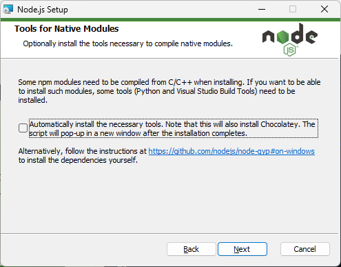

= Installing xPacks on Windows 11

First you have to install `node.js`. Goto to the https://nodejs.org/en[Web site] and download the node.js version. See screenshot below.

Start the executable and run the installation:

Next, accept the license agreement

Next, accept destination folder:

image::images/dest_folder.png[]

Next, select all to be installed:

We don't need tools...

Start the installation

Wait a while until the installation is completed.

Open a DOS-box and check is `npm` works. You may have to set the `%PATH%` environment variable. Start the `Advanced system settings` via the `Search` box.
Under the tab `Advanced`, you'll find `Settings` at the bottom.

Now we have to install `xpm`. Just type

-----
npm install xpm@latest
-----

Check that `xpm` is installed. You may have to set the `%PATH%` enviroment variable. The path is something like `C:\Users\<username>\node_modules\.bin`

-----
xpm --version
-----

It should say something like `0.19.3`.

Now we have to setup a xPack repository:
Make a folder and change to that folder. Here, I use a folder on the `D:` disk:

-----
mkdir riscv
cd riscv
xpm init
-----

Now install the xPack GNU C compiler:

-----
xpm install @xpack-dev-tools/gcc@latest --verbose
-----

This takes a while. Check if `gcc` can be found. You may have to add the `.bin` folder to the `%PATH%` environment variable. Here it should be `d:\riscv\xpacks\.bin`.

Install xPack RISC-V C compiler, Windows build tools and OpenOCD:

-----
xpm install @xpack-dev-tools/riscv-none-elf-gcc@latest --verbose
xpm install @xpack-dev-tools/windows-build-tools@latest --verbose
xpm install @xpack-dev-tools/openocd@latest --verbose
-----

Now you can use a https://www.busybox.net/[_busybox_] shell. Just enter:

-----
sh
-----

Check that the RISC-V compiler works:

-----
riscv-none-elf-gcc --version
-----

It should say something like:

-----
riscv-none-elf-gcc.exe (xPack GNU RISC-V Embedded GCC x86_64) 14.2.0
Copyright (C) 2024 Free Software Foundation, Inc.
This is free software; see the source for copying conditions.  There is NO
warranty; not even for MERCHANTABILITY or FITNESS FOR A PARTICULAR PURPOSE.
-----

You are up and running!
