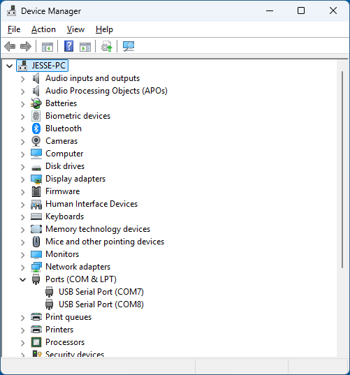
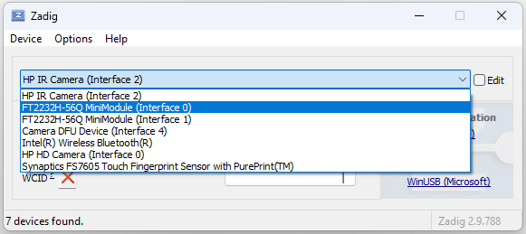
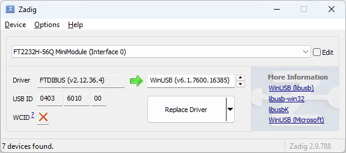

= Installing WinUSB driver for FTDI boards on Windows 11

Download `zadig` from the https://zadig.akeo.ie/[Web site].

Plug in your FTDI serial-to-USB converter. Here we use an FTDI-2232H with two channels. Channel 0 will be used for `openocd` and channel 1 will be used as a serial device.
You can find the devices in the `Device Manager` under `Ports`.

Now start `zadig`. It should show devices. If you can't find the Channels, click on `Options->List All Devices`. Select Channel 0.

Now replace it with the WinUSB driver.

The default driver will be replaced. This can take some time.

